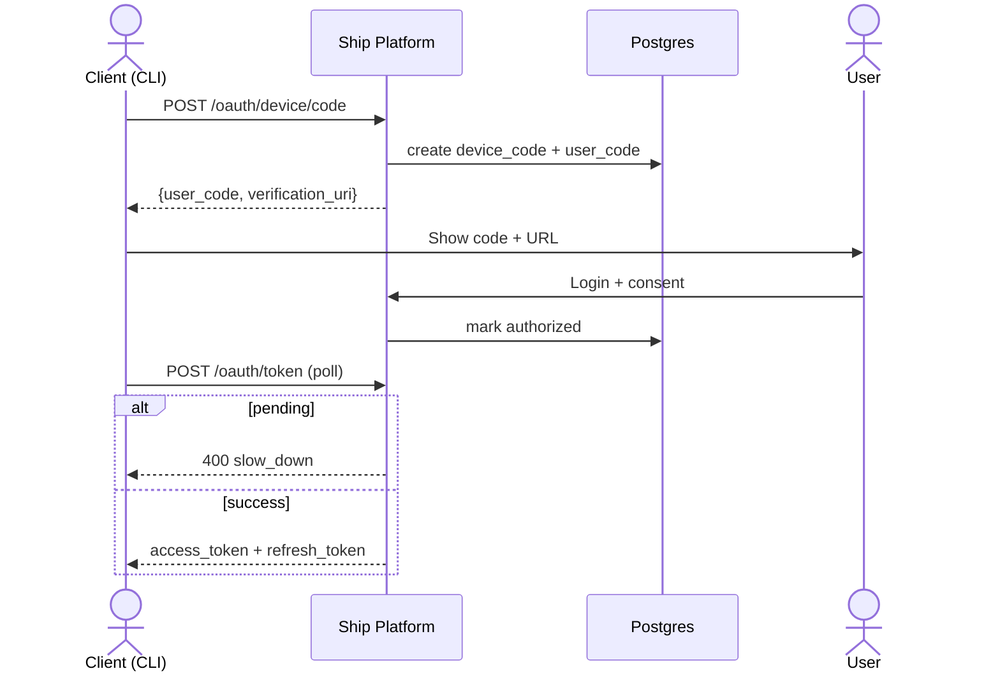
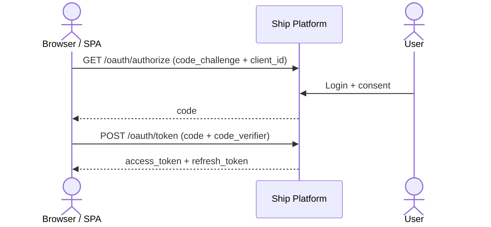
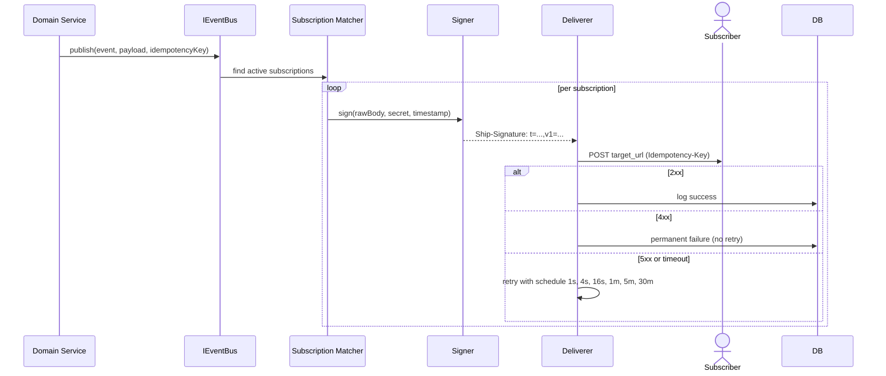

# Plugforge Platform Architecture

This document describes the architecture for the public developer platform layer ("Plugforge") added to Ship. The goal is a small, stable, versioned public contract at `/api/v1/*` that enables third-party developers and the internal agent to interact with Ship as first-class platform citizens.

All changes follow Ship’s established principles: boring technology, direct SQL, strict typing, no new content tables, and heavy reuse of existing patterns.

## Module Layout

```
api/src/
├── platform/                  # All new public contract code (/api/v1/*)
│   ├── oauth/                 # App registration, Authorization Code + PKCE, Device Grant, token issuance & rotation
│   ├── scopes/                # ScopeRegistry (data-driven); requireScope() middleware factory
│   ├── events/                # IEventBus interface + implementations
│   ├── webhooks/              # Subscriptions, HMAC signing, delivery, retries, DLQ, replay
│   ├── ratelimit/             # Per-app and per-token enforcement with standard headers
│   ├── audit/                 # Public call audit trail (extends existing audit service)
│   ├── openapi/               # Registration of v1 paths into the existing OpenAPI registry
│   ├── middleware/            # publicContext, oauthBearerAuth, scopeEnforcer
│   ├── ports/                 # Narrow interfaces to internal domain (DIP)
│   └── routes/                # v1Router
└── routes/                    # Existing internal routes (largely unchanged)

sdk/                           # New pnpm workspace package (@ship/sdk)
├── src/
│   ├── clients/               # Resource clients (DocumentsClient, etc.)
│   ├── auth/                  # deviceLogin, authorizationCodeFlow
│   └── webhooks.ts            # verifyWebhook()
```

## SOLID Rationale

- **SRP**: Each `platform/` module owns one cross-cutting concern. OAuth issuance does not know about webhooks.
- **OCP**: `ScopeRegistry` (`platform/scopes/registry.ts`) allows new scopes to be added at module load without touching validation or middleware logic.
- **LSP**: Any `IEventBus` implementation (in-memory for tests, production implementation) can be substituted without changing event publishers.
- **ISP**: The SDK exposes narrow clients (`DocumentsClient`, `WebhooksClient`, …) rather than one large interface. Backend ports are kept narrow.
- **DIP**: Platform routes and handlers depend on abstractions (`IEventBus`, document ports). Wiring occurs only in the composition root.

## Composition Root

A dedicated composition function (called from `api/src/app.ts`) wires the public layer:

```ts
// Proposed
import { createOAuthService } from './platform/oauth/service.js';
import { ScopeRegistry } from './platform/scopes/registry.js';
import { InMemoryEventBus } from './platform/events/inMemoryBus.js';
import { WebhookDeliverer } from './platform/webhooks/deliverer.js';
import { createV1Router } from './platform/routes/v1.js';
import { oauthBearerAuth } from './platform/middleware/oauthBearerAuth.js';

export function createPublicPlatform(app: Express) {
  const scopeRegistry = new ScopeRegistry();
  const eventBus = new InMemoryEventBus();
  const deliverer = new WebhookDeliverer({ eventBus /* ... */ });

  const oauth = createOAuthService({ /* ... */ });

  const v1Router = createV1Router({ oauth, scopeRegistry, eventBus, deliverer });

  // Public contract uses its own OAuth bearer middleware
  app.use('/api/v1',
    publicContext,
    oauthBearerAuth({ /* validates app, user, scopes, expired token error code */ }),
    scopeEnforcer(scopeRegistry),
    v1Router
  );

  deliverer.start();
}
```

The existing internal `authMiddleware` (session + legacy API tokens) is **not** used on the public surface. A dedicated `oauthBearerAuth` middleware handles the new OAuth access token model, populating `req.oauthClientId`, `req.grantedScopes`, and producing the correct error codes (including a distinct code for expired tokens).

Test wiring substitutes the in-memory event bus and a synchronous no-op deliverer.

## Public/Internal Boundary

```
/api/* (internal)                              /api/v1/* (public)
       │                                              │
       ▼                                              ▼
Internal routes + services                 platform/routes + middleware
       │                                              │
       └─── domain services (documents, issues, …) <──┘
                    │
                    ▼
              Postgres + Yjs (unchanged)
```

- Authentication, scope enforcement, rate limiting, and audit attach **only** at the public layer.
- **Domain event publication** happens inside domain services after successful persistence (never in route handlers or public middleware). This satisfies the PRD rule that “domain layer publishes on writes — never the route layer.”

## OAuth Flows

### Device Authorization Grant (CLI)



### Authorization Code + PKCE (web/SPA)



PKCE verifier validation and refresh token rotation + stolen-token family invalidation occur at the token endpoint.

## Agent Authentication Decision

The internal agent will authenticate using the **Client Credentials grant** (RFC 6749 §4.4).

**Rationale**:
- The agent runs as a machine process with no interactive user.
- Client Credentials is the standard OAuth flow for this scenario and requires no browser or user consent step.
- A dedicated system OAuth app will be created at deployment time (or via migration) with narrowly scoped permissions. Its client credentials are treated as deployment secrets.
- Every action the agent performs will carry its `client_id` in the public audit log, making it visible as a normal platform citizen.

Alternative flows (long-lived personal tokens or Device Grant) were rejected because they either reduce auditability or introduce unnecessary user interaction for a non-human actor.

## Developer Portal

The in-app developer portal (built inside the existing web application and consuming the public `/api/v1` surface) provides:

- Listing and registration of OAuth apps
- One-time display and rotation of client secrets
- Management of webhook subscriptions
- Browsing the delivery log for an app
- Manual replay of failed deliveries from the DLQ

Portal users authenticate with their normal Ship session. The portal uses that session context to call the public OAuth app registration and management endpoints (with workspace-admin privileges where required). This preserves the "eat your own dogfood" principle while still allowing initial privileged operations through the established session auth path.

## Reference Integration & Validation (TTFE Drill)

A reference CLI implementation (in `integrations/cli/`, consuming `@ship/sdk`) serves as the primary proof of the platform:

- `ship login` — Device Authorization Grant flow
- `ship docs create` — creates a document through the public API + SDK
- `ship webhooks tail` — streams and verifies signed webhook deliveries in real time

The Time-to-First-Event (TTFE) drill measures the end-to-end experience from a clean environment:
- `pnpm install @ship/sdk`
- `ship login`
- `ship docs create`
- Receipt of a cryptographically verified `document.created` webhook

Target: < 60 seconds in CI, ≤ 30 minutes on a clean machine following only published documentation. The drill runs on every PR and is the primary regression signal for contract quality.

## Webhook Pipeline



Domain services are the only publishers. The webhook subsystem is responsible for signing and delivery.

**Reliability contract** (per PRD):
- 4xx responses are treated as permanent failures.
- 5xx and timeouts are retried with the exact exponential backoff schedule above.
- After 6 failed attempts the delivery is moved to the DLQ.
- Replay of a DLQ entry always passes through the original `Idempotency-Key`.

**Event Registry**: Event types are defined as data in `platform/events/definitions.ts` with associated Zod schemas. Required events include at minimum: `document.created`, `document.updated`, `document.deleted`, `issue.created`, `issue.assigned`, `issue.status_changed`, `sprint.started`, `sprint.completed`. New event types are added by extending the registry (OCP).

## SDK Surface (`@ship/sdk`)

```ts
interface ShipClientOptions {
  token: string;
  baseUrl?: string;
}

class ShipClient {
  readonly documents: DocumentsClient;   // stable
  readonly issues: IssuesClient;         // stable
  readonly sprints: SprintsClient;       // stable
  readonly webhooks: WebhooksClient;     // stable

  // User-facing flows (stable)
  static async deviceLogin(opts: DeviceLoginOptions): Promise<ShipClient>;
  static async authorizationCodeFlow(opts: AuthCodeOptions): Promise<ShipClient>;

  // Machine-to-machine (Client Credentials) – used by the internal agent (stable)
  static async clientCredentials(opts: ClientCredentialsOptions): Promise<ShipClient>;

  // Direct token injection (for bootstrapped server-side clients)
  constructor(opts: ShipClientOptions);
}

function verifyWebhook(
  headers: Record<string, string>,
  rawBody: string,
  secret: string,
  toleranceSec?: number
): boolean;   // stable
```

All public surfaces above are considered stable at 1.0. Internal helper types and advanced configuration remain pre-1.0. The SDK is hand-written and fitness-tested against the generated OpenAPI spec for parity.

The internal agent obtains its initial token via the system OAuth app’s Client Credentials (seeded at deployment) and uses `ShipClient.clientCredentials(...)` (or the constructor with a token obtained through that flow). Token refresh for Client Credentials is handled by re-exchanging when the token nears expiry. All agent actions appear in the public audit trail under the agent’s `client_id`.

## Key Public Contracts

- **Error shape**: `ApiError { code, message, details?, request_id }` (see `api/src/platform/contracts/schemas/common.ts` and the generated OpenAPI).
- **Rate limiting**: All public responses include `X-RateLimit-Limit`, `X-RateLimit-Remaining`, and `X-RateLimit-Reset`. 429 responses include `Retry-After`.
- **Cursor pagination**: Opaque base64 cursors over `{ id, timestamp }`. List responses always return `{ data, next_cursor }`.
- **Full contracts**: Request/response schemas, scopes, and error codes are defined in the OpenAPI 3.1 document served at `/api/v1/openapi.json` (generated from the same Zod registry used internally, with a 3.1 generator path for the public spec).

## Failure Modes

- **Token store corrupted**: Affected OAuth clients receive clear, actionable errors. Existing sessions and legacy API tokens remain unaffected. Client secrets can be rotated through the developer portal.
- **Webhook signing secret rotated mid-flight**: Every delivery attempt is signed with the secret that is currently active for the subscription at the moment the delivery is prepared. Replay uses the secret that is active at replay time. There is no secret versioning; subscribers must be prepared to handle a signature failure on replay by refreshing their local copy of the secret.
- **Queue deliverer crashes**: At-least-once semantics with idempotency keys. Failed deliveries are retained in the `webhook_deliveries` table (DLQ status) and can be replayed from the developer portal. The table records at minimum: `subscription_id`, `event_id`, `attempt_number`, `response_status`, `response_excerpt`, `latency_ms`, and is queryable per OAuth app.
- **OpenAPI generator throws at boot**: The process fails fast. The CI fitness test (which validates the generated spec and SDK surface parity) prevents such a build from reaching production.

---

This document covers only the public platform contract layer. The core unified document model, real-time collaboration, and existing internal APIs are unchanged.