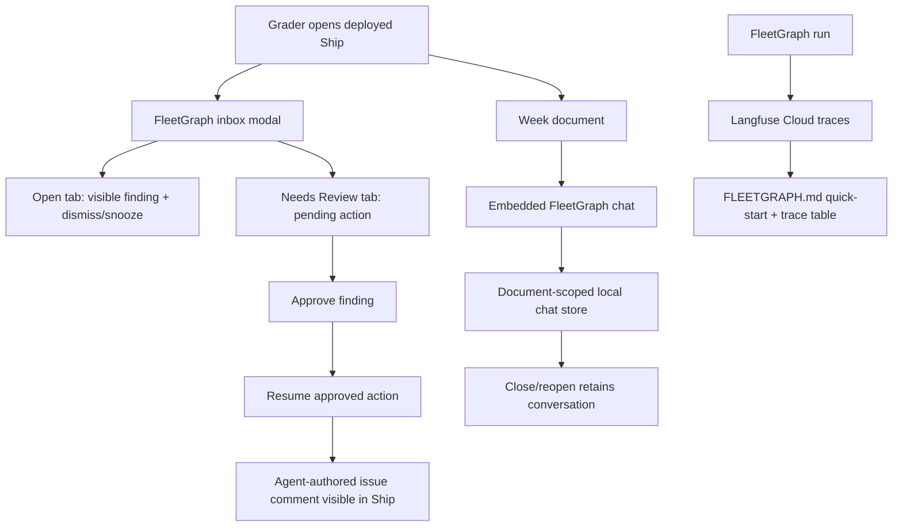

# feat: Polish FleetGraph submission experience

## Summary

Make the FleetGraph submission feel finished by tightening the deployed proof path, removing browser-demo friction from the HITL flow, preserving embedded chat context across panel toggles, and replacing stale evidence language with current Langfuse and deployment guidance.

---

## Problem Frame

FleetGraph has the core MVP wedge: a proactive LangGraph detector, HITL finding lifecycle, embedded chat, seeded demo data, deployment, latency proof, and runbooks. The remaining weakness is not core engineering depth; it is that the browser experience and written evidence still make a grader work too hard. The inbox defaults to open findings while the strongest HITL demo row is `pending_review`, chat state disappears when the panel closes, some docs still say credentials are pending, and the deployed proof path needs a concise smoke record with trace-link instructions.

This plan optimizes for a narrow, polished, grader-facing path rather than broadening architecture scope.

---

## Requirements

**Submission evidence**

- R1. `FLEETGRAPH.md` must stop claiming Langfuse credentials are missing and instead describe the current evidence status: trace capture/share/update is the remaining proof step.
- R2. `FLEETGRAPH.md` must include a grader quick-start block with deployed URL, demo login, key demo documents, and where trace links belong once captured.
- R3. The demo script must identify when traces are generated, how to open them in Langfuse Cloud, and what to show.

**Browser demo polish**

- R4. The FleetGraph inbox must expose both open findings and pending-review findings without console calls.
- R5. The pending-review HITL card must support approve, reject, and resume through visible UI controls in the main demo path.
- R6. The inbox empty state must describe the selected lifecycle state rather than implying FleetGraph disappeared.
- R7. Embedded chat must preserve document-scoped conversation state when the chat panel is closed and reopened on the same document.
- R8. Chat empty, streaming, and failure states must remain accessible and stable after persistence changes.

**Verification**

- R9. Unit coverage must prove lifecycle tab/filter behavior, pending-review action flow, and chat persistence.
- R10. Browser coverage must exercise the no-console demo path: open inbox, switch to Needs Review, approve/resume, and verify chat survives close/reopen.
- R11. Deployed smoke verification must confirm login, health, inbox availability, chat SSE, and the current limitation or success status for Langfuse trace links.

---

## Assumptions

- Langfuse is acceptable observability for the assignment even though the original brief says LangSmith.
- The target for this pass is Sunday-submission polish, not full target architecture completion.
- Proactive detection remains the graph-backed flagship path; direct SSE chat remains an explicitly documented MVP deviation.
- The safest demo path can use pre-staged rows, while live route-triggered findings and Langfuse traces are recorded as evidence rather than performed under camera pressure.
- The existing public droplet at `http://143.198.163.184/` remains the submission environment.

---

## Key Technical Decisions

- **Polish the existing outcome model instead of adding detectors:** Pending-review visibility and resume UI make the existing HITL work legible. Extra detectors would broaden scope without improving the flagship proof path.
- **Use lifecycle tabs inside the modal:** Tabs are familiar, low-risk, and map directly to the existing `lifecycle_state` query parameter. They avoid new route architecture while making `pending_review` discoverable.
- **Keep chat persistence client-side for this pass:** Persisting messages by document id in browser storage fixes the close/reopen demo bug without adding a server chat-history data model before submission.
- **Document architecture deviations as intentional constraints:** The final docs should say proactive is LangGraph and chat is direct SSE with shared context builders. Avoid claiming graph parity that the code does not implement.
- **Treat live traces as proof artifacts, not feature work:** The application already instruments Langfuse. The work is smoke, capture, share links, and update docs unless runtime verification exposes a defect.

---

## High-Level Technical Design

---

## Implementation Units

### U1. Grader-Facing Evidence Docs

**Goal:** Make the written submission current, concise, and clickable-ready.

**Requirements:** R1, R2, R3, R11

**Dependencies:** None

**Files:**

- `FLEETGRAPH.md`
- `docs/fleetgraph-5-minute-demo-script.md`

**Approach:** Add a top-level grader quick-start block to `FLEETGRAPH.md` with deployed URL, login, demo document URLs, and trace-link slots. Replace stale “credentials missing” wording with the current status: keys were configured, links must be generated/shared and pasted. Keep the chat-vs-graph caveat explicit. Update the demo script with precise “trace generated here” notes for proactive finding, quiet path, and chat, plus concise Langfuse Cloud steps.

**Patterns to follow:** Existing trace and runtime evidence sections in `FLEETGRAPH.md`; deployed URL table in `docs/fleetgraph-5-minute-demo-script.md`.

**Test scenarios:**

- Test expectation: none for static docs; verify by reading that no evidence table still claims local credentials are absent.

**Verification:** A grader can find login, target URLs, trace-link status, and architecture caveats in under one minute from `FLEETGRAPH.md`.

### U2. Inbox Lifecycle Tabs And Demo-Safe HITL Flow

**Goal:** Make open and pending-review findings discoverable and operable from the browser UI.

**Requirements:** R4, R5, R6, R9, R10

**Dependencies:** None

**Files:**

- `web/src/components/FleetGraph/FindingsInbox.tsx`
- `web/src/components/FleetGraph/FindingsInbox.test.tsx`
- `web/src/components/FleetGraph/FindingCard.tsx`
- `web/src/components/FleetGraph/FindingCard.test.tsx`
- `web/src/components/FleetGraph/FleetGraphInboxModal.tsx`
- `e2e/fleetgraph-ui.spec.ts`

**Approach:** Add tabs for `Open`, `Needs Review`, `Approved`, and `Resolved` or a narrower set if implementation shows a cleaner existing pattern. The selected tab drives `useFleetGraphFindingsQuery({ lifecycleState })`. Keep query invalidation broad so realtime updates refresh all tabs. For `approved` findings, preserve the existing resume button and make the copy clearer for the demo. Empty states should name the selected tab and suggest the next place to look.

**Execution note:** Start with unit tests around tab selection and pending-review query parameters before editing the UI.

**Patterns to follow:** Existing `FindingsInbox` query/mutation structure; `FindingCard` lifecycle controls; `e2e/fleetgraph-ui.spec.ts` route mocks.

**Test scenarios:**

- Rendering defaults to the `Open` tab and requests `lifecycle_state=open`.
- Selecting `Needs Review` requests `lifecycle_state=pending_review` and renders pending action controls.
- Approving a pending-review card sends the action candidate id and moves the UI out of the pending-review list after invalidation.
- Resuming an approved card posts to the action resume endpoint and removes or updates the card after success.
- Empty state for `Needs Review` says there are no findings needing review, not “No open findings.”
- E2E mock flow opens the modal, selects `Needs Review`, approves/resumes, and verifies the route requests without browser console helpers.

**Verification:** The demo can show approve and resume from the FleetGraph modal without opening DevTools.

### U3. Embedded Chat Persistence And State Polish

**Goal:** Keep scoped chat feeling native by preserving conversation state across close/reopen for the same document.

**Requirements:** R7, R8, R9, R10

**Dependencies:** None

**Files:**

- `web/src/components/FleetGraph/EmbeddedChat.tsx`
- `web/src/components/FleetGraph/EmbeddedChat.test.tsx`
- `web/src/lib/fleetgraphChatMemory.ts`
- `web/src/lib/fleetgraphChatMemory.test.ts`
- `e2e/fleetgraph-ui.spec.ts`

**Approach:** Introduce a small typed chat memory helper keyed by `documentType` and `documentId`, backed by `localStorage` when available. Load saved completed/sent messages on mount, write after each message state change, and clear any stale streaming placeholder on unmount or request cancellation. Keep failed messages visible but exclude them from request history as today. Guard storage failures explicitly so private browsing or storage quotas do not break chat.

**Execution note:** Implement the memory helper test-first as pure functions plus a storage adapter boundary, then wire the component.

**Patterns to follow:** Existing stream reducer in `web/src/lib/fleetgraphChatState.ts`; `createId` fallback tests; current `buildConversationHistory` filtering behavior.

**Test scenarios:**

- Memory key includes document type and document id, so two documents do not share chat history.
- Loading malformed storage data returns an empty history and does not throw.
- Close/reopen on the same document restores the prior user and assistant messages.
- A failed message remains visible after failure but is not sent in `conversationHistory`.
- A streaming placeholder is not persisted if the component unmounts mid-stream.
- E2E chat test closes and reopens the chat panel and still sees the completed assistant answer.

**Verification:** During a Brave rehearsal, closing and reopening chat on the Week document preserves the answer that was just streamed.

### U4. Deployed Smoke And Trace Capture Runbook

**Goal:** Prove the public environment supports the polished demo path and produce the evidence needed for final docs.

**Requirements:** R1, R2, R3, R10, R11

**Dependencies:** U1, U2, U3

**Files:**

- `docs/fleetgraph-5-minute-demo-script.md`
- `FLEETGRAPH.md`
- Optional smoke notes under `docs/fleetgraph-agent-exercise-guide.md` if the runbook needs one durable command.

**Approach:** Verify the deployed `/health` endpoint, login with `dev@ship.local`, FleetGraph inbox tabs, approve/resume, and chat SSE in Brave. Check droplet environment for OpenAI and Langfuse variables without exposing secret values. Generate or inspect Langfuse Cloud traces for quiet, finding, and chat paths; paste share links into `FLEETGRAPH.md` if available. If a trace cannot be captured during implementation, document the exact blocking runtime evidence rather than leaving stale “pending credentials” language.

**Patterns to follow:** Existing deploy smoke checks in `orientation/deployment.md`; Langfuse CLI/UI instructions in `docs/fleetgraph-agent-exercise-guide.md`; demo URL table in `docs/fleetgraph-5-minute-demo-script.md`.

**Test scenarios:**

- Test expectation: browser smoke plus CLI health checks, because this unit verifies deployed integration rather than introducing local logic.

**Verification:** `FLEETGRAPH.md` contains either actual share links or a current, specific blocker with the last smoke timestamp; the demo script matches the deployed UI after U2 and U3.

---

## Scope Boundaries

### In Scope

- Browser-visible FleetGraph inbox polish for open, pending-review, approved, and resolved states.
- Client-side scoped chat memory for demo reliability.
- Evidence docs and trace-capture instructions.
- Deployed smoke checks needed to support final submission.

### Deferred to Follow-Up Work

- Unifying direct SSE chat into the compiled LangGraph path.
- Replacing `MemorySaver` with `PostgresSaver`.
- Adding stale blocker, missing standup, planless week, and overload detectors.
- Implementing chat-initiated action requests.
- Adding persistent server-side chat history.
- Building an admin UI for FleetGraph rate limits, model config, or trace health.

---

## System-Wide Impact

This pass changes the user-facing FleetGraph demo surface and local browser persistence. It should not change the database schema, proactive detector decisions, policy authorization, or Ship write primitives. The only production behavior change outside UI is any documentation-backed deployment verification, which must avoid printing secret values.

---

## Risks And Dependencies

- **Deployed trace capture may fail because droplet env differs from local:** Verify environment variable presence without exposing values and document a specific blocker if traces do not appear.
- **Local storage can produce stale or malformed chat history:** Use strict parsing and safe empty fallback in the chat memory helper.
- **Tabs can hide findings after lifecycle changes:** Invalidate all FleetGraph findings queries after mutations and keep tab-specific empty states clear.
- **Resume UX can overpromise navigation to comments:** If direct comment deep-linking is not already reliable, prefer a toast or clear target-document link over fragile scroll automation.

---

## Acceptance Examples

- AE1. Given the deployed demo workspace has a pending-review FleetGraph finding, when the grader opens the FleetGraph inbox and selects `Needs Review`, then the pending card is visible with Approve and Reject actions.
- AE2. Given a pending-review card has a `draft_comment` action candidate, when the user approves it and then resumes the approved action, then the app calls the approve and resume APIs without browser-console helpers.
- AE3. Given the user streams an answer in FleetGraph chat on a Week document, when the user closes and reopens the chat panel on that same document, then the prior user prompt and assistant answer remain visible.
- AE4. Given `FLEETGRAPH.md` is opened cold, when a grader scans the first section, then they can find deployed URL, login, demo targets, trace-link status, and the chat-vs-graph caveat.

---

## Sources And Research

- `FLEETGRAPH.md` documents the current MVP architecture, target graph, test cases, and stale trace-link status.
- `docs/fleetgraph-5-minute-demo-script.md` contains the current beginner-friendly demo runbook and deployed URLs.
- `web/src/components/FleetGraph/FindingsInbox.tsx` currently defaults to `open` findings only.
- `web/src/components/FleetGraph/FindingCard.tsx` already supports approve, reject, dismiss, snooze, and resume controls based on lifecycle state.
- `web/src/components/FleetGraph/EmbeddedChat.tsx` currently stores messages only in component state, which explains close/reopen context loss.
- `api/src/routes/fleetgraph.ts` already exposes lifecycle filtering and approve/resume APIs; UI polish can reuse the existing contract.
- `e2e/fleetgraph-ui.spec.ts` already covers FleetGraph modal and chat with route mocks and can be extended for the no-console demo path.
