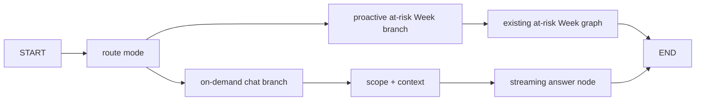

# FleetGraph Unified LangGraph Runtime

## Problem Frame

FleetGraph currently has two high-quality but architecturally split modes:

- Proactive detection runs through a compiled LangGraph detector in `api/src/fleetgraph/detectors/at-risk-week.ts`.
- On-demand chat is context-scoped and observable, but it streams directly through `ChatOpenAI` from `api/src/fleetgraph/chat.ts`.

The grader feedback is precise: both modes should go through the same LangGraph flow. Sharing context builders, auth, model config, and Langfuse is not enough. The next submission needs a truthful architecture where proactive and on-demand paths enter one compiled FleetGraph graph and branch by mode.

## Scope

In scope:

- Add a top-level compiled FleetGraph LangGraph orchestrator with explicit `proactive_at_risk_week` and `ondemand_chat` branches.
- Route the existing proactive at-risk Week runner through the top-level graph.
- Route `/api/fleetgraph/chat` through the top-level graph while preserving current SSE token streaming behavior.
- Preserve the existing at-risk Week detector graph as the detector subgraph implementation rather than rewriting detector internals.
- Add tests that prove both modes invoke the same compiled graph entry point and that chat still streams correctly.
- Update `FLEETGRAPH.md`, the demo script, and exercise guide so the architecture claim matches code.
- Run an Impeccable UI review for any UI surface touched during this task, especially FleetGraph inbox/chat if code changes reach the browser.

Out of scope:

- Building additional detectors beyond at-risk Week.
- Implementing chat-initiated write actions.
- Moving graph checkpoints from `MemorySaver` to `PostgresSaver`.
- Replacing the current HITL persistence model with LangGraph `interrupt()`/`Command({ resume })`.
- Reworking the visual design of Ship outside FleetGraph surfaces.

## Requirements Trace

| ID | Requirement | Source |
|---|---|---|
| R1 | On-demand chat and proactive detection must enter the same compiled LangGraph architecture. | Grader feedback |
| R2 | Current demo-critical chat behavior, SSE token streaming, heartbeat, abort handling, rate limits, auth, and scoped context must continue working. | Existing app behavior |
| R3 | The proactive at-risk Week path must preserve guard, pre-filter, reason, policy, output, persistence, usage, Langfuse, and latency behavior. | Existing tests and PRD |
| R4 | Documentation must stop describing the split path as current state after the fix lands. | Submission integrity |
| R5 | UI changes made as part of the fix must pass an Impeccable review before shipping. | User request |

## Architecture Decision

### Decision: Introduce a top-level FleetGraph orchestrator graph

Create a new graph module, tentatively `api/src/fleetgraph/graph.ts`, that compiles one `StateGraph` named `fleetgraph.runtime`. It owns mode routing and delegates branch work:



This is the least risky honest fix because it gives both modes a shared compiled graph entry point without destabilizing the mature detector graph or the SSE transport.

### Decision: Preserve SSE streaming by injecting a token sink into the chat node

LangGraph nodes can execute async work. The chat branch should receive an `onToken` callback in its dependencies and call the existing `streamFleetGraphChatModelResponse` inside the graph node. The route still opens SSE and writes heartbeat/token/final events, but the model invocation happens inside the compiled graph.

This gives the grader-visible truth:

```text
/api/fleetgraph/chat -> runFleetGraphGraph(mode: ondemand_chat) -> chat node -> model stream
```

### Decision: Use branch-specific payloads instead of a vague generic state

Avoid `unknown`-heavy graph state. Define discriminated inputs:

- `FleetGraphProactiveAtRiskWeekInput`
- `FleetGraphOnDemandChatInput`
- `FleetGraphGraphInput = ...`

The top-level graph state should make invalid mode/payload combinations unrepresentable in TypeScript where practical.

### Decision: Keep detector subgraph as an implementation detail

The at-risk Week graph already has deep tests. The top-level graph should delegate to `runAtRiskWeekGraph` in the proactive branch. That keeps the detector implementation stable while still making the public FleetGraph runtime graph the entry point for proactive execution.

## Implementation Units

### U1: Characterize the current split and add failing unified-entry tests

**Files**

- Modify: `api/src/fleetgraph/chat-runner.test.ts`
- Modify or create: `api/src/fleetgraph/graph.test.ts`
- Modify: `api/src/fleetgraph/proactive-runner.ts` tests if present or add coverage near trigger tests

**Approach**

Start test-first. Add a graph-level test proving:

- A proactive input invokes a compiled FleetGraph graph branch and delegates to an at-risk Week runner dependency.
- An on-demand chat input invokes the same compiled graph module and streams through a supplied model/token sink.
- The chat route depends on a graph runner abstraction, not direct prompt/model execution as its only path.

The tests may use fake branch dependencies, but they should exercise the public graph runner, not private node functions.

**Test scenarios**

- Given `mode: 'proactive_at_risk_week'`, `runFleetGraphGraph` returns proactive output and records branch `proactive_at_risk_week`.
- Given `mode: 'ondemand_chat'`, `runFleetGraphGraph` returns chat completion, calls `onToken` in order, and records branch `ondemand_chat`.
- Given a malformed mode/payload pairing, validation fails before a model call.

**Verification**

- The new graph tests fail before implementation because no unified graph exists.

### U2: Add the top-level FleetGraph graph module

**Files**

- Create: `api/src/fleetgraph/graph.ts`
- Modify: `api/src/fleetgraph/index.ts` if exports exist

**Approach**

Implement a compiled `StateGraph` with:

- `route` node to classify mode and initialize branch metadata.
- `proactiveAtRiskWeek` node that calls an injected `runAtRiskWeekGraph` dependency.
- `onDemandChat` node that calls existing chat prompt/model streaming utilities through injected dependencies.
- `END` routing after each branch.

Keep dependencies explicit:

- `client`
- `config` or model factory
- `contextBuilders`
- `onToken`
- `trace/runtime` dependencies already used by chat and proactive paths
- `runAtRiskWeekGraph`

**Test scenarios**

- Graph compiles once and can run each mode independently.
- Branch metadata includes mode, branch, document id, workspace id, and trace-friendly names.
- Chat branch preserves usage metadata and completion response.
- Proactive branch preserves returned detector result without swallowing errors.

**Verification**

- `pnpm --filter @ship/api exec vitest run src/fleetgraph/graph.test.ts`

### U3: Route proactive execution through the top-level graph

**Files**

- Modify: `api/src/fleetgraph/proactive-runner.ts`
- Modify tests around proactive runner and triggers as needed

**Approach**

Change `createAtRiskWeekScopeRunner` so its public runner calls the top-level FleetGraph graph with `mode: 'proactive_at_risk_week'`. The graph branch then calls the existing detector graph.

Keep the existing dependency injection style so tests can pass fake graph runners. Do not remove existing detector tests.

**Test scenarios**

- Scope runner constructs a top-level graph proactive input with workspace id, scoped doc id, run id, trigger source, and requestedAt.
- Existing proactive tests still verify guard/pre-filter/reason/policy/output behavior through the detector graph.
- Trigger tests still pass, proving poll/mutation paths are unaffected.

**Verification**

- Relevant API FleetGraph proactive tests pass.

### U4: Route on-demand chat through the top-level graph

**Files**

- Modify: `api/src/routes/fleetgraph-chat.ts`
- Modify: `api/src/fleetgraph/chat.ts`
- Modify: `api/src/routes/fleetgraph-chat.test.ts`
- Modify: `api/src/fleetgraph/chat-runner.test.ts`

**Approach**

Extract route orchestration so the route still owns:

- Request validation
- Auth/scope actor context
- Rate limit
- SSE headers and heartbeat
- Abort handling
- Writing token/final/error events

But replace direct prompt/model execution with a call to the top-level graph using `mode: 'ondemand_chat'`. The graph branch owns:

- Scope resolution
- Context loading
- Prompt construction
- Trace context
- Model creation
- Streaming completion via the route-provided `onToken`

**Test scenarios**

- Chat route streams tokens and final response through a fake graph runner.
- Chat route rate limit returns 429 without invoking the graph.
- Scope/config/model errors still return existing pre-stream or stream error behavior.
- Existing history trimming behavior still applies.
- Langfuse trace name remains `fleetgraph.chat.response` or is intentionally documented if renamed under the top-level graph.

**Verification**

- `pnpm --filter @ship/api exec vitest run src/routes/fleetgraph-chat.test.ts src/fleetgraph/chat-runner.test.ts`

### U5: Update documentation and trace story

**Files**

- Modify: `FLEETGRAPH.md`
- Modify: `docs/fleetgraph-5-minute-demo-script.md`
- Modify: `docs/fleetgraph-agent-exercise-guide.md`

**Approach**

Replace split-path language with current-state unified graph language. Keep deferred items honest:

- Still `MemorySaver`, not `PostgresSaver`.
- Still one proactive detector.
- Still no chat-initiated writes unless implemented separately.
- Still HITL persistence via outcome tables, not LangGraph interrupts.

Add a short note on how traces should now look:

- Top-level FleetGraph graph branch metadata.
- Proactive branch with nested at-risk Week detector trace.
- On-demand chat branch with model streaming trace.

**Test scenarios**

- Search docs for stale phrases: `direct OpenAI streaming`, `not yet a LangGraph node path`, `not fully unified`, `split path`.
- Verify docs still mention honest deferred architecture where appropriate.

**Verification**

- `rg -n "direct OpenAI streaming|not yet a LangGraph node path|not fully unified|split path" FLEETGRAPH.md docs/fleetgraph-5-minute-demo-script.md docs/fleetgraph-agent-exercise-guide.md`

### U6: Impeccable UI review for touched FleetGraph surfaces

**Files**

- Review likely surfaces: `web/src/components/FleetGraph/FindingsInbox.tsx`, `web/src/components/FleetGraph/FindingCard.tsx`, `web/src/components/FleetGraph/EmbeddedChat.tsx`, `web/src/components/Editor.tsx`
- Modify only if implementation work touches UI or if the review finds clear defects introduced by the unified graph work.

**Approach**

Use the `impeccable` skill after implementation. Register is product UI: dense work tool, not marketing. Review:

- Inbox tabs and action placement.
- Chat panel loading/streaming/error states.
- Action Items modal interference with opening chat.
- Accessibility names for FleetGraph controls.
- Responsive behavior of the side-by-side editor/chat layout.

This unit is review-oriented. It should not become a redesign unless the current change introduces or exposes a user-facing defect.

**Test scenarios**

- Browser smoke on a document with FleetGraph chat.
- Confirm chat open button is reachable after dismissing the Action Items modal.
- Confirm text does not overflow in tab labels or action buttons.

**Verification**

- Playwright E2E for FleetGraph UI still passes.
- Any UI adjustments have focused component tests or E2E coverage when behavior changes.

## Test Plan

Run focused tests first:

- `pnpm --filter @ship/api exec vitest run src/fleetgraph/graph.test.ts`
- `pnpm --filter @ship/api exec vitest run src/routes/fleetgraph-chat.test.ts src/fleetgraph/chat-runner.test.ts`
- `pnpm --filter @ship/api exec vitest run src/fleetgraph/detectors/at-risk-week.test.ts src/fleetgraph/detectors/at-risk-week-persistence.test.ts`
- `pnpm --filter @ship/web exec vitest run src/components/FleetGraph/FindingsInbox.test.tsx src/components/FleetGraph/FindingCard.test.tsx src/components/FleetGraph/EmbeddedChat.test.tsx src/lib/fleetgraphChatMemory.test.ts`

Then integration checks:

- `pnpm --filter @ship/api test` if local database is available.
- `PLAYWRIGHT_WORKERS=1 pnpm exec playwright test e2e/fleetgraph-ui.spec.ts`.

Manual smoke after implementation:

- Open FleetGraph inbox.
- Open Week 14, dismiss Action Items if present, open FleetGraph chat, ask the demo question.
- Confirm Langfuse shows top-level graph metadata for the chat branch.

## Risks

| Risk | Mitigation |
|---|---|
| SSE streaming becomes buffered or delayed by graph invocation. | Keep `onToken` callback in graph dependencies and write SSE events immediately from route. Add route streaming tests. |
| Top-level graph becomes a thin wrapper and still feels performative. | Make both proactive and chat paths enter `runFleetGraphGraph`; route/proactive runners depend on the graph runner abstraction. |
| Tests overfit implementation details. | Assert public runner behavior and route behavior, not private node internals. |
| Proactive detector tests become brittle if nested graph changes trace shape. | Preserve detector graph tests and add separate top-level graph tests. |
| UI review expands scope. | Treat Impeccable findings as targeted polish only unless a blocker affects demo usability or accessibility. |

## Open Decisions

1. Whether to expose top-level graph traces as a separate Langfuse observation around nested branch traces, or only as branch metadata in existing traces. Recommendation: add branch metadata first; add a top-level observation only if it does not duplicate trace noise.
2. Whether chat history memory should remain client-side only for this phase. Recommendation: yes, unrelated to graph unification.
3. Whether to run full API regression locally or rely on focused tests if the local database is unavailable. Recommendation: run full API regression when Docker Postgres is available.

