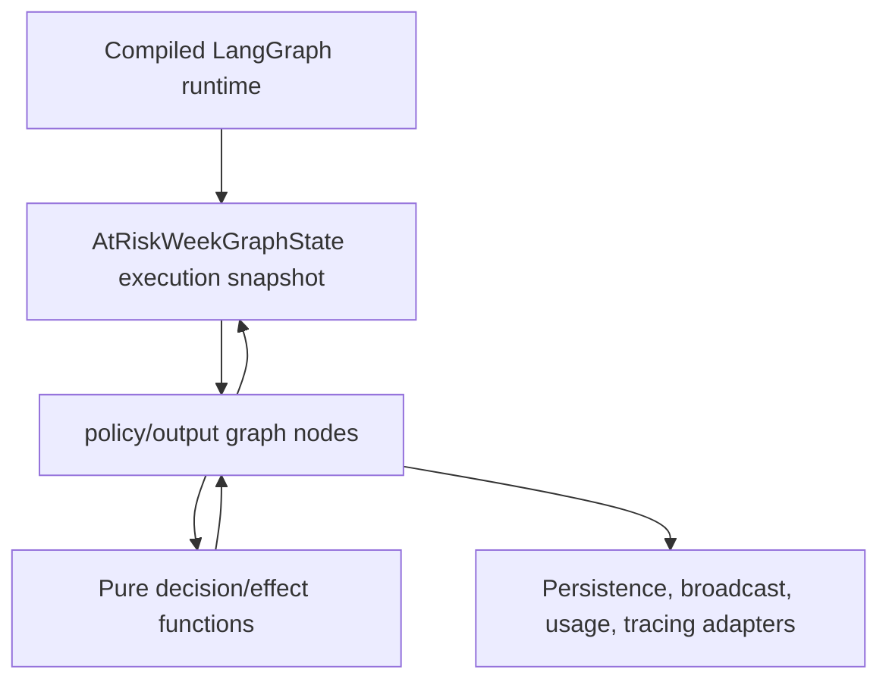

# FleetGraph Functional Core Refactor

## Summary

Preserve FleetGraph's compiled LangGraph runtime while simplifying the at-risk Week detector internals. The first increment introduces pure decision/effect functions behind existing graph nodes so LangGraph remains the observable submission shell and the core risk pipeline becomes easier to test and maintain.

---

## Problem Frame

FleetGraph's previous god-file refactor split model reasoning, output persistence, policy, tracing, usage, and evaluator nodes into focused modules. That made the system reviewable, but the remaining coupling still flows through `AtRiskWeekGraphState`. The next refactor should not add more ports or weaken the rubric-critical graph. It should make node internals call pure functions that return typed results, with graph nodes acting as adapters from execution state to domain decisions.

---

## Requirements

**Submission safety**

- R1. Keep the compiled LangGraph runtime intact for proactive and on-demand FleetGraph paths.
- R2. Preserve existing node names, branch paths, trace metadata shape, V1/V2 eval expectations, and public export semantics.
- R3. Avoid touching original Ship code or unrelated web/dashboard surfaces.

**Functional core**

- R4. Introduce pure FleetGraph decision/effect functions for at-risk Week policy/output behavior without requiring Postgres, Langfuse, LangChain, or graph compilation in their tests.
- R5. Keep graph nodes as thin adapters that read `AtRiskWeekGraphState`, invoke pure functions, and write the existing state shape back.
- R6. Do not remove the defensive contract helpers until a typed result model makes them redundant and existing tests prove behavior is unchanged.

**Verification**

- R7. Full API type-check, focused FleetGraph detector tests, deterministic V1/V2 evals, and source-only lint checks must pass after each landable slice.
- R8. Generated eval report timestamp churn must remain out of commits unless the expected report content intentionally changes.

---

## Key Technical Decisions

- KTD1. **LangGraph remains the shell:** The graph is part of the product and rubric evidence, not incidental infrastructure. Refactoring targets node internals, not graph identity or trace topology.
- KTD2. **Functional core before more adapters:** The next maintainability gain is typed pure functions for decisions/effects, not additional repository or provider interfaces.
- KTD3. **Tracer-bullet through output effects first:** Output/policy mapping is a good first slice because it currently bridges domain reasoning to durable finding/action side effects, and it can be tested without graph execution.
- KTD4. **Commit in small verified slices:** Each slice should remain reviewable and reversible, with behavior proved by existing FleetGraph tests and evals.

---

## High-Level Technical Design

The graph and state shape stay stable. The change is inside node implementation: graph nodes translate state into pure inputs, pure functions return typed decisions/effects, and adapters execute side effects from those effects.

---

## Implementation Units

### U1. Introduce pure output effect construction

- **Goal:** Add a pure function that converts at-risk Week context, guard, reasoning, and policy into a typed finding/action effect.
- **Files:** `api/src/fleetgraph/detectors/at-risk-week-output.ts`, `api/src/fleetgraph/detectors/at-risk-week-output.test.ts`
- **Patterns:** Follow existing `at-risk-week-output.ts` persistence input mapping and `at-risk-week-persistence.test.ts` assertions.
- **Test Scenarios:**
  - Produces an effect with workspace, scope, run, detector type, severity, evidence, recipient, lifecycle, material-change key, and action candidate.
  - Throws the existing contract error when called with non-at-risk reasoning.
  - Produces a null broadcast effect when there is no owner user.
- **Verification:** Focused output tests, focused detector suite, V1/V2 evals.

### U2. Convert output node into an adapter over the effect

- **Goal:** Make `outputNode` call the pure effect builder, then persist and broadcast based on that effect.
- **Files:** `api/src/fleetgraph/detectors/at-risk-week-output.ts`, `api/src/fleetgraph/detectors/at-risk-week-persistence.test.ts`
- **Patterns:** Preserve `PersistedAtRiskWeekOutput`, `AtRiskWeekBroadcastError`, and existing broadcast payload shape.
- **Test Scenarios:**
  - Existing persistence tests still pass without changes to expected output.
  - Broadcast payload remains unchanged for owner-recipient findings.
  - Completed graph state remains unchanged after output node completion.
- **Verification:** Focused detector suite, V1/V2 evals, API type-check.

### U3. Evaluate whether the state contract can shrink further

- **Goal:** After U1/U2, inspect whether any `requireAtRiskWeek*` calls in output/policy are now avoidable without changing trace behavior.
- **Files:** `api/src/fleetgraph/detectors/at-risk-week-evaluator.ts`, `api/src/fleetgraph/detectors/at-risk-week-policy.ts`, `api/src/fleetgraph/detectors/at-risk-week-output.ts`
- **Patterns:** Do not remove contract helpers speculatively. Only delete if the pure result model makes the helper redundant and tests prove unchanged behavior.
- **Test Scenarios:**
  - Contract error tests remain meaningful.
  - No branch-path, lifecycle, or action-candidate eval expectation changes.
- **Verification:** Source-only lint for changed files, focused detector suite, V1/V2 evals.

---

## Scope Boundaries

- Keep original Ship code out of scope.
- Keep web/dashboard cleanup out of scope.
- Keep LangGraph compilation, node names, and trace topology out of scope for behavior change.
- Do not attempt to replace the 7-node graph with a linear pipeline in this increment.
- Do not introduce new providers, new repositories, or new public APIs.

---

## Risks & Dependencies

- **Risk:** Pure effect types duplicate existing persistence shapes. Mitigation: make the effect represent domain intent, not database rows, and keep one mapping point into `persistOutput`.
- **Risk:** State-shape changes could disturb trace/eval expectations. Mitigation: do not change `AtRiskWeekGraphState` in U1/U2.
- **Risk:** Generated eval reports create noisy diffs. Mitigation: restore generated report timestamp churn unless expectation content changes.

---

## Sources / Research

- `api/src/fleetgraph/detectors/at-risk-week.ts` defines the compiled graph facade and execution state.
- `api/src/fleetgraph/detectors/at-risk-week-output.ts` owns output persistence and broadcast mapping.
- `api/src/fleetgraph/detectors/at-risk-week-policy.ts` owns policy classification for at-risk findings.
- `api/src/fleetgraph/detectors/at-risk-week-persistence.test.ts` covers output node persistence and broadcast behavior.
- `api/src/fleetgraph/evals.ts` and `pnpm fleetgraph:eval` protect V1/V2 graph, policy, chat, and observability contracts.
