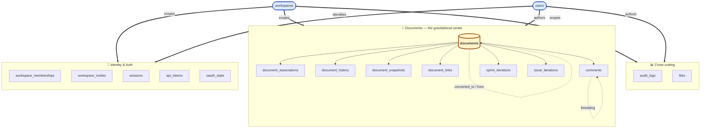
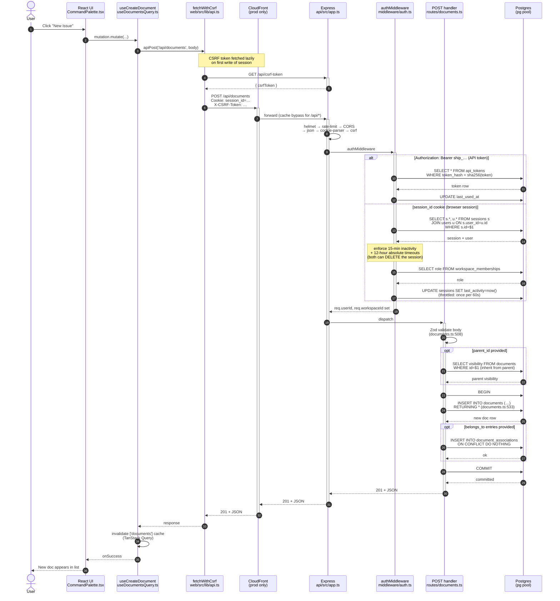

# ShipShape Orientation — Appendix Walkthrough

> Source: *GFA Week 4 — ShipShape*, "Appendix: Codebase Orientation Checklist"
> Project: `US-Department-of-the-Treasury/ship`
> Owner: Cameron Candelori — orientation deadline: 4 hours after project receipt.

This directory is the working artifact of the Phase 0 orientation. The appendix
in the project brief is a structured 4-hour read of the codebase that has to be
completed **before** any auditing happens. The brief is explicit:

> "Your orientation notes become part of your final submission."

So treat this directory as durable. Fill in the blanks with file paths, line
numbers, and your own commentary. The intent is not to copy what's already in
`docs/` — it's to build a personal mental model that you can defend in the demo
video and the final write-up.

## How to use this directory

| File | Purpose |
|---|---|
| `README.md` (this file) | The 8-step checklist with prompts and where to look. Expand each section in-place. |
| `deep-dives/unified-document-model.md` | One table holds issues, wikis, projects, sprints. Why, how, and the tradeoffs. |
| `deep-dives/real-time-collaboration.md` | WebSockets, Yjs CRDTs, persistence. Conceptual heavy lifter. |
| `deep-dives/typescript-patterns.md` | Generics, discriminated unions, utility types, type guards — the toolkit the audit will use. |
| `deep-dives/request-flow-and-auth.md` | Tracing a request from React → Express → Postgres → back. Middleware chain and session model. |
| `deep-dives/auth-providers.md` | The three auth providers (PIV/CAC mTLS, password, API tokens), DCR/JWKS flow, vendored SDK patch, WS-timeout asymmetry. |

Add new deep-dive files when you find another concept that deserves its own
mental model. Keep them under `orientation/deep-dives/<topic>.md` so they all
collect in one place.

## The three phases at a glance

```
Phase 1 — First Contact (mechanical: get it running, find the seams)
  1. Repository Overview
  2. Data Model
  3. Request Flow

Phase 2 — Deep Dive (conceptual: how the moving parts move)
  4. Real-time Collaboration
  5. TypeScript Patterns
  6. Testing Infrastructure
  7. Build and Deploy

Phase 3 — Synthesis (judgment: what's strong, what's weak, what would scale)
  8. Architecture Assessment
```

The 7 audit categories (Phase 1 of the project, *not* of orientation) line up
roughly with the orientation deep-dives — type safety with §5, API response
time and DB query efficiency with §3 and §2, accessibility and bundle size
mostly with the web tree, runtime error handling with §4 (collab is the
hardest place to get error recovery right), test coverage with §6. Use the
orientation to figure out *where* to measure before the 36-hour audit clock
starts.

---

## Phase 1 — First Contact

### 1. Repository Overview

**Goal:** Get the app running locally and form a top-down map of the monorepo.

**To do**
- [x] Cloned, ran `pnpm dev`, hit the local URL. Real first-contact gaps relative to `README.md` captured under **"First-contact gaps"** at the end of this section.
- [x] Read every file in `docs/`. Summarized in conversation; key architectural findings folded into the deep-dives.
- [x] Read `shared/src/` end-to-end (see Findings below).
- [x] Draw a one-page diagram of `web/` ↔ `api/` ↔ `shared/` (see Findings below).

**Where to look (verified)**
- Monorepo root: `pnpm-workspace.yaml`, `tsconfig.json`, `package.json`
- Three packages: `web/`, `api/`, `shared/`
- Aux trees: `e2e/`, `terraform/`, `scripts/`, `docs/`, `plans/`

### Findings

**Stack at the package level.** pnpm@10.27.0 workspaces, Node ≥20, TypeScript 5.7.2 pinned everywhere. Two non-obvious build-order constraints:

- `@ship/shared` must build first (`pnpm build:shared`) because `@ship/api` and `@ship/web` consume `dist/` via `workspace:*`. The root `build:api` and `build:web` scripts already chain this.
- `@ship/api`'s `build` script copies `src/db/schema.sql` and the `migrations/` directory into `dist/` — they're runtime assets, not just dev artifacts.

**Package-relation diagram.**

```
┌───────────────────────────────────────────────────────────────────────────┐
│                             ship/ (monorepo)                              │
│   pnpm-workspace.yaml  •  TypeScript 5.7.2  •  Node ≥20  •  pnpm 10.27    │
│                                                                           │
│   ┌──────────────────┐   ┌──────────────────┐   ┌──────────────────┐    │
│   │   @ship/shared   │   │    @ship/api     │   │    @ship/web     │    │
│   │                  │   │                  │   │                  │    │
│   │  Pure TS types   │◀──│  Express 4.21    │◀─▶│  React 18 + Vite │    │
│   │  + 4 constants   │   │  + pg 8.13       │ws │  + TipTap 2.27   │    │
│   │  (no runtime     │   │  + ws / yjs      │   │  + TanStack 5.91 │    │
│   │   logic except   │   │  + zod 3.24      │   │  + Tailwind 3.4  │    │
│   │   computeICE     │   │  + zod-to-       │   │  + USWDS 3.13    │    │
│   │   Score helper)  │   │    openapi 7     │   │  + y-websocket   │    │
│   │                  │   │  + openid-client │   │  + y-indexeddb   │    │
│   │  workspace:*     │   │  + AWS SDK v3    │   │  + react-router  │    │
│   │  consumed by     │   │  + MCP SDK       │   │                  │    │
│   │  both api/ web   │   │                  │   │  Imports shared  │    │
│   │                  │   │  Imports shared  │   │  via workspace:* │    │
│   └──────────────────┘   └──────────────────┘   └──────────────────┘    │
│        Built first        Built after shared     Built after shared      │
│                                                                          │
│   ┌─────────────┐  ┌──────────────┐  ┌────────────┐  ┌──────────────┐  │
│   │    e2e/     │  │  terraform/  │  │  scripts/  │  │    docs/     │  │
│   │  Playwright │  │  AWS infra   │  │  dev.sh,   │  │  32 markdown │  │
│   │  77+ specs  │  │  EB, S3,     │  │  deploy.sh │  │   guides     │  │
│   │             │  │  CloudFront, │  │            │  │              │  │
│   │             │  │  Aurora      │  │            │  │              │  │
│   └─────────────┘  └──────────────┘  └────────────┘  └──────────────┘  │
└───────────────────────────────────────────────────────────────────────────┘
```

**What crosses the boundary** (read with the diagram):

| Direction | What | Mechanism |
|---|---|---|
| web → api | HTTP REST under `/api/*` | `fetch` with `credentials: 'include'` (session cookie) and a CSRF token (`web/src/lib/api.ts`) |
| web → api | Yjs sync | `y-websocket` provider on `/collaboration/{roomPrefix}:{docId}` |
| web → shared | Type imports | `import type` of `Document`, `IssueProperties`, etc. (zero runtime cost) |
| api → shared | Type imports + constants | `SESSION_TIMEOUT_MS`, `ABSOLUTE_SESSION_TIMEOUT_MS`, `HTTP_STATUS`, `ERROR_CODES` are the only runtime values |
| api → web | Static HTML/JS | Served by S3/CloudFront in prod, by Vite dev server locally |

**`shared/` inventory** (5 source files; total runtime content: 4 constants + 1 helper).

- `shared/src/index.ts` — single barrel re-exporting `./types/*` and `./constants.js`.
- `shared/src/constants.ts` — `HTTP_STATUS`, `ERROR_CODES`, `SESSION_TIMEOUT_MS = 15·60·1000`, `ABSOLUTE_SESSION_TIMEOUT_MS = 12·60·60·1000` (cited inline as "NIST SP 800-63B-4 AAL2 requirement").
- `shared/src/types/document.ts` — 345 lines, by far the densest. Defines the `DocumentType` union (10 literal values), the `Document` base interface, ten per-type `*Properties` interfaces with index signatures (`[key: string]: unknown`), ten per-type `*Document` discriminated-union variants, `ApprovalTracking`, `ICEScore`, `BelongsTo`, `CascadeWarning`, and the only runtime helper: `computeICEScore(impact, confidence, ease)`. Comments confirm `program_id`/`project_id`/`sprint_id` were dropped in migrations 027/029.
- `shared/src/types/api.ts` — `ApiResponse<T>` + `ApiError`. These describe the *new* error shape; legacy routes return `{ error: string }` (see Finding #3 in the docs audit).
- `shared/src/types/auth.ts` — **empty by design.** Single comment: "All auth types are defined locally in api/ and web/ packages." This is a real architectural signal: the auth seam is *not* shared, which means web and api each define their own session/user/auth shape and they can drift.
- `shared/src/types/user.ts` — `User` (id/email/name/isSuperAdmin/lastWorkspaceId/dates).
- `shared/src/types/workspace.ts` — `Workspace`, `WorkspaceMembership`, `WorkspaceInvite`, `AuditLog`, `WorkspaceWithRole`, `MemberWithUser`.

**Audit-relevant findings for §1**

- **shared/ contributes essentially zero runtime bundle bytes** (4 constants + 1 trivial helper). Any web bundle bloat is in web/ and its deps, not shared/.
- **Auth types are unshared by design.** This is unusual — most apps share a `Session` or `AuthedUser` shape. Worth tracking whether web's local auth types diverge from api's; the new error shape (`ApiResponse<T>`) is the canonical one but legacy routes don't use it.
- **`Record<string, unknown>` on `Document.content` and `Document.properties`.** This single decision is the source of most type-safety violations downstream (see §5). It exists because Postgres returns JSONB as untyped JSON; a domain mapper layer would close the gap.
- **`@ts-expect-error` is rare (1 occurrence) and `@ts-ignore` is absent.** The codebase is already disciplined here.

**First-contact gaps** (what wasn't in `README.md` and what required guessing during the actual `pnpm dev` walk):

- **Port 5432 conflict — Postgres.app vs Docker.** `README.md:103` says `docker-compose up -d`. If a native Postgres.app is already running on `:5432`, the docker container fails to bind. The actual fix on this machine was `pg_ctl stop -D "~/Library/Application Support/Postgres/var-18" -m fast` first. Worse, Postgres.app's `trust` auth mode rejects the API's login flow even when the port is free. **README doesn't mention this conflict.** Tracked at `orientation/next-session.md:50, 81–89, 166`.
- **Web dev port is non-deterministic.** `scripts/dev.sh`'s port-finder lands on the first free port from 5173. Different orientation/audit scripts hard-code different ports — `normal-usage.mjs` defaults to `:5173`; `voiceover-walk.mjs` defaults to `:4173` (preview build); `scenarios.mjs` defaults to `:5174` (now `WEB` env var). **README states `:5173` as if it were fixed.** Set `WEB=http://localhost:<port>` to match your stack.
- **macOS Accessibility + Automation permissions required for VoiceOver baselining.** `@guidepup/guidepup` needs the terminal (iTerm in this case) to have both permissions granted in System Settings → Privacy & Security. Additionally `defaults write com.apple.VoiceOver4/default SCREnableAppleScript -bool true` must be set, and VoiceOver must have been launched at least once so `/private/var/db/Accessibility/.VoiceOverAppleScriptEnabled` exists. **README doesn't mention any of this** — it's a Cat 7 baselining prerequisite, not a Ship dev prerequisite, but the gap is real for an auditor.
- **`playwright-chromium` postinstall downloads ~169 MB of Chromium.** Not a Ship dependency directly, but the demo deck / Cat 6 scenarios use Playwright via `pnpm exec` from the workspace. First run is slow.
- **`pnpm install` from a nested directory inside the workspace.** A sub-project like `orientation/demo-deck/` needs `pnpm install --ignore-workspace` to get its own `node_modules`; otherwise pnpm tries to splice it into the root workspace listed at `pnpm-workspace.yaml`. **README is silent on this** because it assumes you're working from the root.
- **CLAUDE.md is the load-bearing setup doc, not README.md.** `README.md` has the basics; the real "what `pnpm dev` does" walkthrough (env file creation, port-finder, migration on fresh DB, multi-worktree) lives in `.claude/CLAUDE.md` under "Commands". A new engineer reading only README would miss the dev-script behavior.

---

### 2. Data Model

**Goal:** Understand how one table represents many document types and how relationships are expressed.

**To do**
- [x] Open `api/src/db/schema.sql`. 17 tables enumerated below.
- [x] List every file in `api/src/db/migrations/` chronologically. 37 migrations, grouped into 4 eras below.
- [x] Locate the `documents` table and the `document_type` column. Three example queries documented below.
- [x] Find the `document_associations` table. Relationship types: `parent`, `program`, `project`, `sprint`.
- [x] Read the *legacy* columns. Update from CLAUDE.md: **all three** (`program_id`, `project_id`, `sprint_id`) were dropped — `project_id`/`sprint_id` in migration 027, `program_id` in 029. Only `parent_id` remains on `documents`.

**Where to look (verified)**
- Schema: `api/src/db/schema.sql`
- Migrations: `api/src/db/migrations/NNN_*.sql` — `001` through `037` (37 files)
- DB client: `api/src/db/client.ts` (pool max 20 prod / 10 dev; 30s idle + 30s statement timeout)
- Seed: `api/src/db/seed.ts`
- Authoritative design: `docs/unified-document-model.md`
- Convention layer: `docs/document-model-conventions.md`

**Deep dive:** [`deep-dives/unified-document-model.md`](./deep-dives/unified-document-model.md) — why one table, what the tradeoffs are, what to look for when the audit gets to query efficiency.

### Findings

**Table inventory** (17 tables — far more than just `documents`):

| Table | Purpose |
|---|---|
| `workspaces` | Top-level org unit; holds `sprint_start_date` |
| `users` | Global identity; tracks `last_auth_provider` |
| `workspace_memberships` | Auth layer (admin/member roles) |
| `workspace_invites` | Email + PIV invite flow |
| `sessions` | 15-min inactivity + 12-hour absolute timeout |
| `oauth_state` | OAuth/PKCE flow state |
| `audit_logs` | All mutations; nullable actor for failed logins |
| `api_tokens` | SHA-256 hashed CLI tokens with `token_prefix` |
| **`documents`** | The unified table |
| `document_associations` | The junction table for `parent`/`program`/`project`/`sprint` |
| `document_history` | Field-level change log with `automated_by` flag |
| `document_snapshots` | Pre-conversion snapshots (reason: `conversion` or `manual`) |
| `sprint_iterations` | Per-sprint pass/fail tracking for Claude `/work` sessions |
| `issue_iterations` | Per-issue pass/fail tracking |
| `files` | S3 upload pipeline metadata |
| `document_links` | Backlinks |
| `comments` | Threaded comments with resolution state |

**Topology diagram** (16 of 17 tables; `oauth_state` is orphan and omitted). This is a *topology* view, not a schema view — for column types and FK columns, see the table inventory above and the per-table detail in `api/src/db/schema.sql`. Thick arrows (`scopes` / `identifies` / `authors`) indicate "this column exists on every table in the target cluster"; thin arrows are explicit FKs.



What the diagram makes obvious:

- **Two roots, not one.** `workspaces` is the *scope* root (tenancy boundary); `users` is the *identity* root (who did this). Every non-trivial table carries both `workspace_id` and a user FK (`created_by`, `author_id`, `uploaded_by`, etc.). The auth path puts both on every request as `req.workspaceId` and `req.userId`.
- **`documents` is the gravitational center.** Seven tables hang off it (`document_associations`, `document_history`, `document_snapshots`, `document_links`, `comments`, `sprint_iterations`, `issue_iterations`), plus two self-refs: `parent_id` for the wiki tree hierarchy and `converted_to_id`/`converted_from_id` for the issue↔project conversion lineage. Migration 025 added a Postgres trigger preventing circular `parent_id` chains (max depth 100).
- **`document_associations` is the only table that joins `documents` to itself N-to-N** (one row → `document_id` + `related_id`, both FK to `documents`). Hidden in the simplified arrow; reflected in the two composite indexes `(document_id, type)` and `(related_id, type)`.
- **Comments thread; backlinks don't.** Both are doc-to-doc references but `comments` has a `parent_id` self-ref (for nested replies) and `document_links` doesn't (one-direction backlink only).
- **`audit_logs` and `files` are cross-cutting, not document-attached.** They scope to workspace + user but don't FK into `documents`. So a deleted document doesn't cascade into its audit history — that's intentional.
- **No FKs from `properties->>'assignee_id'`, `properties->>'owner_id'`, etc.** — those are JSONB pointers, no referential integrity. If a person document is archived, references in other docs' `properties` go stale silently. **Audit hook for the data-integrity / runtime-error categories.**

**Migrations** (42 files = 37 numbered + 5 "b" variants), grouped into 4 eras. Each is a transaction in `api/src/db/migrate.ts`; failures auto-rollback. Schema versions tracked in `schema_migrations`.

**Era 1 — Foundation & properties (001 → 008)**
- `001_properties_jsonb` — Migrate per-type columns (issue/program/project/sprint) into the unified JSONB `properties` bag. Adds GIN index on `properties`. **The decision that creates the unified model.**
- `002_person_membership_decoupling` — Decouple `person` documents from `workspace_memberships` so person docs can exist without a live membership.
- `003_document_history` — Create `document_history` table + add `started_at`/`completed_at`/`cancelled_at`/`reopened_at` status timestamps to `documents`.
- `004_fix_person_user_id_backfill` — Backfill missing `user_id` properties on person documents.
- `005_create_missing_person_documents` — Create person documents for users that didn't have one.
- `006_document_visibility` — Add `visibility` column (`'private'` | `'workspace'`) with default `'workspace'`.
- `007_archived_and_deleted_at` — Add `archived_at` (soft archive) and `deleted_at` (30-day soft delete) columns + partial indexes.
- `007b_remove_prefix_add_emoji` — Add `emoji` column to projects; remove legacy `prefix` column.

**Era 2 — Auth & workspace infrastructure (008 → 015b)**
- `008_consolidate_feedback` — Consolidate feedback/source tracking into `properties`.
- `009_audit_logs_nullable_actor` — Make `audit_logs.actor_user_id` nullable so failed-login attempts can be logged.
- `010_oauth_state` — Add `oauth_state` table (OAuth/PKCE `code_verifier` storage).
- `011_piv_invite_support` — Add X.509 subject-DN columns on `workspace_invites` to support PIV-cert-based invites.
- `012_require_invite_email` — Make `workspace_invites.email` NOT NULL.
- `013_fix_duplicate_users` — Fix case-sensitivity / case-folding issues in `users.email` uniqueness.
- `014_api_tokens` — Add `api_tokens` table for CLI auth. Tokens stored as SHA-256 hash + `token_prefix` for identification (the `ship_` portion).
- `014b_backfill_missing_person_documents` — Safety pass to re-create any still-missing person docs.
- `015_add_last_auth_provider` — Track per-user `last_auth_provider` (`'fpki_validator'`, `'caia'`, `'password'`, etc.).
- `015b_sprint_iterations` — Create `sprint_iterations` table for tracking Claude `/work` session attempts per sprint (status: pass/fail/in_progress).

**Era 3 — Document types & relationships (016 → 025)**
- `016_document_history_automated_by` — Add `automated_by` flag distinguishing system-driven changes from user edits.
- `017_standup_sprint_review_types` — Extend `document_type` enum with `'standup'` and `'weekly_review'`.
- `018_archive_orphaned_pending_persons` — Archive person documents that have no associated `user_id`.
- `018b_document_conversion` — Add conversion tracking: `converted_to_id`, `converted_from_id`, `converted_at`, `converted_by`, `original_type`, `conversion_count`.
- `019_migrate_ice_333_to_null` — Migrate legacy ICE score "333" sentinel (meaning "not yet set") to actual `NULL`.
- `020_document_associations` — **The cutover migration.** Create `document_associations` junction table with `relationship_type` enum (`'parent' | 'program' | 'project' | 'sprint'`) and the 5 supporting indexes.
- `020b_sprint_assignee_ids` — Add `assignee_ids` array property to sprints.
- `021_migrate_associations` — Backfill `document_associations` rows from the legacy `program_id`/`project_id`/`sprint_id` columns. Reads still flip to the junction table after this.
- `022_sprint_project_associations` — Create the sprint → project associations specifically.
- `023_document_snapshots` — Add `document_snapshots` table for pre-conversion snapshots (`reason`: `'conversion'` or `'manual'`).
- `024_renumber_collision_migrations` — Resolve a numbering collision from parallel branches.
- `025_prevent_circular_parent` — Add Postgres trigger `prevent_circular_parent_trigger` enforcing acyclic `parent_id` chains (max depth 100).

**Era 4 — Cleanup & finalization (026 → 037)**
- `026_issue_iterations` — Create `issue_iterations` table (parallel to `sprint_iterations`, for per-issue work tracking).
- `027_drop_legacy_association_columns` — **Drop `documents.sprint_id` and `documents.project_id`.** Reads/writes must use `document_associations` after this point.
- `028_backfill_program_associations` — Backfill any remaining `program_id` values to associations before the next migration drops the column.
- `029_drop_program_id_column` — **Drop `documents.program_id`** with a self-healing backfill that catches any rows added between 028 and 029 (raises `EXCEPTION` if `orphan_count != 0`).
- `030_deprecate_goal_to_hypothesis` — Rename the `goal` field in properties to `hypothesis`.
- `031_cleanup_accountability_issues` — Clean up state on accountability-tracking issues (de-duplication / archival).
- `032_rename_hypothesis_to_plan` — Rename `hypothesis` → `plan` in properties. *Final* naming.
- `033_sprint_to_week_rename` — Rename `sprint` → `week` in UI strings and some property paths. **The `document_type` enum value `'sprint'` is unchanged in the database** — the user-facing rename did not touch the discriminator.
- `034_backfill_past_weekly_docs_submitted` — Backfill `submitted_at` on past weekly_plan/weekly_retro docs.
- `035_add_comments` — Create `comments` table with threading (`parent_id` self-ref) and resolution state.
- `036_fix_audit_and_comments_fks` — Fix FK constraints on `audit_logs` and `comments` that were under-specified.
- `037_week_dashboard_model` — Add week-dashboard tracking (per-person weekly plans, retros, standups roll-up).

**Footnotes**
- Naming history of the project-level summary field: `goal` → `hypothesis` (migration 030) → `plan` (migration 032). When reading old code/data, all three names refer to the same field.
- `sprint` → `week` rename (033) is *cosmetic*: routes, types, and `document_type` values still use `'sprint'`; only UI strings changed. This is the most likely source of "wait, is this a sprint or a week?" confusion when reading code.

**The `documents` table at a glance**: `id`, `workspace_id`, `document_type` (enum of 10 literals), `title`, `position`, `content` (JSONB — TipTap state), `yjs_state` (BYTEA — CRDT state), `parent_id`, `properties` (JSONB), `ticket_number`, `archived_at`, `deleted_at`, `started_at`/`completed_at`/`cancelled_at`/`reopened_at` (issue status), `converted_to_id`/`converted_from_id`/`converted_at`/`converted_by`/`original_type`/`conversion_count`, `created_by`, `visibility` ('private' | 'workspace'), `created_at`, `updated_at`.

**Three real `document_type` queries**:
1. `api/src/routes/dashboard.ts:95–114` — assignee's active issues. Filters `document_type = 'issue' AND (properties->>'assignee_id')::uuid = $2 AND properties->>'state' NOT IN ('done','cancelled')`. Joins `document_associations` twice for sprint and program context.
2. `api/src/routes/workspaces.ts:235–280` — archived person documents. Filters `document_type = 'person' AND archived_at IS NOT NULL`. Joins `users` via `(properties->>'user_id')::uuid`.
3. `api/src/routes/admin.ts:1630–1640` — diagnostic for orphan issues. `NOT EXISTS (SELECT 1 FROM document_associations da WHERE da.document_id = d.id AND da.relationship_type = 'project')`.

**Indexes on `documents` and `document_associations`** (the load-bearing ones):

- `idx_documents_active` — `(workspace_id, document_type) WHERE archived_at IS NULL AND deleted_at IS NULL`. Most queries depend on this.
- `idx_documents_properties` — GIN on the whole `properties` JSONB.
- `idx_documents_person_user_id` — expression index `((properties->>'user_id'))` filtered to `document_type = 'person'`. The only expression index on JSONB properties.
- `idx_documents_visibility`, `idx_documents_visibility_created_by` — private-doc lookups.
- `idx_documents_archived_at`, `idx_documents_deleted_at` — partial indexes.
- `document_associations`: 5 indexes including the two composites `(related_id, relationship_type)` and `(document_id, relationship_type)` that support both lookup directions.

**Audit-relevant DB findings**

- **Missing expression indexes on hot JSONB paths.** `properties->>'state'` (used in dashboard.ts:103), `(properties->>'assignee_id')::uuid` (dashboard.ts:102), `(properties->>'sprint_number')::int` (seed.ts:466, dashboard.ts:231), and `(properties->>'owner_id')::uuid` are all filtered on but only the GIN index covers them. GIN works for containment (`@>`), poorly for inequality/cast. **High-leverage finding for the DB-efficiency audit.**
- **`parent_id` still on `documents`.** Unlike `program/project/sprint`, the wiki tree hierarchy is *not* in the junction table. Trigger `prevent_circular_parent_trigger` enforces max-depth-100 acyclicity.
- **`document_associations` UPDATEs are not audited.** Moving an issue to a different project does not write to `document_history`. Compliance gap; trigger would fix it.
- **No `document_links` audit.** Backlinks created via `@mention` aren't logged either.
- **Soft-delete is consistent.** Every read query I sampled filtered `deleted_at IS NULL`. Partial indexes prevent scanning soft-deleted rows.

---

### 3. Request Flow

**Goal:** Trace a single user action — say, "create an issue" — from the React component, through the API, into Postgres, and back to the rendered UI. Once you can do this for one action, every other action is a variation.

**To do**
- [x] Pick `POST /api/documents`. Trigger lives in `web/src/components/CommandPalette.tsx:130–141`; mutation hook is `useCreateDocument()` in `web/src/hooks/useDocumentsQuery.ts:39–47, 82–131`.
- [x] Trace the request: fetch wrapper is `apiPost()` → `fetchWithCsrf()` in `web/src/lib/api.ts:78–116`. Cookies via `credentials: 'include'`; CSRF via `X-CSRF-Token` header fetched at `/api/csrf-token`.
- [x] On the server: route handler at `api/src/routes/documents.ts:505`. Middleware chain documented below.
- [x] Found the SQL — see snippet below; all parameterized.
- [x] Mapped the auth path — three providers converge on the session cookie. Detail below.

**Where to look (verified)**
- App bootstrap: `api/src/app.ts` (middleware mounted in lines ~94–238)
- Middleware: `api/src/middleware/auth.ts`, `api/src/middleware/visibility.ts`
- Routes: `api/src/routes/documents.ts`, `api/src/routes/auth.ts`, `api/src/routes/api-tokens.ts`
- DB client: `api/src/db/client.ts`
- OpenAPI: `api/src/openapi/` (Zod → OpenAPI via `@asteasolutions/zod-to-openapi`) and `api/src/swagger.ts`

**Deep dive:** [`deep-dives/request-flow-and-auth.md`](./deep-dives/request-flow-and-auth.md) — middleware order, what session state actually lives where, what an unauthenticated request looks like at every layer. See also [`deep-dives/auth-providers.md`](./deep-dives/auth-providers.md).

### Findings

**Flow diagram — POST /api/documents end to end.** Sequence view showing the canonical write path through the middleware chain, the two-provider auth branch, the SQL writes, and the response. Optional steps (parent visibility inheritance, association inserts) are marked `opt`. CloudFront is shown but only sits in front of the API in `prod`/`shadow`; in local dev the browser hits Express directly.



What the diagram makes obvious:

- **Three of the eight participants live in the browser** (UI, Hook, API client). The wire crossing happens at the `API → CF` arrow — that's the only network hop on the request side.
- **Auth is the only middleware that branches.** Everything else in the Express middleware chain is straight-line. The branch is by *credential shape* (Bearer header vs. session cookie), not by route.
- **The session-cookie path runs three SQL queries before the route handler even sees the request** (session+user join, membership lookup, activity update). API-token path runs two. This is the per-request auth overhead — a candidate for caching during the API-response-time audit.
- **The two `opt` blocks are the only conditional SQL writes**. Everything else fires every time. The base cost of "create a document" is one SELECT (CSRF) + auth SQL + `BEGIN` / `INSERT` / `COMMIT`.
- **CloudFront is transparent for `/api/*`** — no caching, no transformation. Its only role is TLS termination and `Upgrade`-header forwarding. The diagram step `CF → Express` is essentially a wire passthrough.
- **The whole flow is single-process on the server side.** No queue, no microservice hop. Express, auth middleware, and route handler are all in the same Node process; `pg` does connection pooling to the one Postgres.

**The middleware chain — in order** (from `api/src/app.ts`):

1. `helmet()` — security headers (HSTS/CSP/CORB).
2. CloudFront trust-proxy override — rewrites `X-Forwarded-Proto` to https when behind CloudFront.
3. Rate limiter — 100 req/min in prod, 1000 in dev.
4. CORS — `credentials: true` against configured origin.
5. `express.json({ limit: '10mb' })`.
6. `express.urlencoded()`.
7. `cookieParser(sessionSecret)`.
8. `express-session` — but the auth path doesn't use it; the real session is custom.
9. Public endpoints mounted: `/api/csrf-token`, `/health`, `/api/docs` (Swagger), `/api/setup`, `/api/feedback`.
10. Login rate limiter — 5 failed attempts / 15 min.
11. **Route-level CSRF.** `conditionalCsrf` is applied **per route**, not globally. Skips Bearer-token requests (so API tokens bypass CSRF — correct).
12. `/api/documents` and other write routes — CSRF-protected; auth applied per route via `authMiddleware`.
13. Read-only routes (search, activity, dashboard) — no CSRF.

Ordering smells: JSON parser (5) sits before cookie parser (7) — fine. No global error handler is mounted — Express falls back to a default that returns HTML. **This is a finding for the runtime-error audit category.**

**Auth middleware** (`api/src/middleware/auth.ts`):

- **Provider 1 — API tokens** (lines 70–108). Checks `Authorization: Bearer ship_...`, looks up SHA-256 hash in `api_tokens`, validates expiration, updates `last_used_at`, sets `req.isApiToken = true`.
- **Provider 2 — Session cookie** (lines 110–208). Extracts `req.cookies.session_id`, joins `sessions × users`, enforces **both** the 12-hour absolute timeout (line 158) and the 15-minute inactivity timeout (line 172). Both expirations delete the session row and return `SESSION_EXPIRED`.
- **Provider 3 — PIV/CAC mTLS.** Lives in a separate route (`caia-auth.ts`); after handshake the user gets a session cookie like provider 2.
- **Cookie sliding-window refresh is throttled** to once per 60s (line 213). Smart — prevents `Set-Cookie` on every request.

**`req.user` shape and what populates it**: `req.userId`, `req.workspaceId`, `req.isSuperAdmin`, `req.isApiToken`, `req.sessionId`. Note these are not a single `req.user` object — they're flat properties on the request. Workspace membership is verified only on the session path (lines 183–201), **not the API-token path**. Worth verifying: a revoked workspace membership won't block API-token access until the token itself is revoked.

**Visibility middleware** (`api/src/middleware/visibility.ts`):

Not actually a middleware — it's a *utility module* with helpers (`isWorkspaceAdmin`, `getVisibilityContext`, `VISIBILITY_FILTER_SQL`). The macro at line 49 emits the SQL fragment `(visibility = 'workspace' OR created_by = $userId OR $isAdmin = TRUE)` which routes splice into their `WHERE` clauses. Visibility isn't enforced uniformly — each route opts in.

**Canonical trace: POST /api/documents**

| Step | File | Lines |
|---|---|---|
| UI button | `web/src/components/CommandPalette.tsx` | 130–141 |
| Frontend mutation | `web/src/hooks/useDocumentsQuery.ts` | 82–131 |
| Fetch wrapper (cookie + CSRF) | `web/src/lib/api.ts` | 78–116 |
| Express bootstrap | `api/src/app.ts` | 94–238 |
| JSON parser | `api/src/app.ts` | 142 |
| Cookie parser | `api/src/app.ts` | 144 |
| CSRF middleware | `api/src/app.ts` | 53–61 |
| Documents router mount | `api/src/app.ts` | 183 |
| Route handler | `api/src/routes/documents.ts` | 505 |
| Zod validation | `api/src/routes/documents.ts` | 508–512 |
| Parent visibility inheritance SELECT | `api/src/routes/documents.ts` | 519–526 |
| INSERT (parameterized) | `api/src/routes/documents.ts` | 533–538 |
| Optional association INSERT | `api/src/routes/documents.ts` | 545–572 |
| Commit / response | `api/src/routes/documents.ts` | 574–583 |
| Frontend cache update | `web/src/hooks/useDocumentsQuery.ts` | 119–130 |

**The SQL the handler runs**:

```sql
INSERT INTO documents
  (workspace_id, document_type, title, parent_id, properties, created_by, visibility, content)
VALUES ($1, $2, $3, $4, $5, $6, $7, $8)
RETURNING *
```

All eight parameters are parameterized. ✓ No injection risk.

**OpenAPI registration**: Routes register with a global `registry` (`api/src/openapi/registry.ts:20`) via `registry.registerPath({ method, path, ... })`. The schema lives alongside as Zod (`api/src/openapi/schemas/documents.ts`). The generated spec serves at `/api/docs` (Swagger UI), `/api/openapi.json`, and `/api/openapi.yaml`. The MCP tools per `CLAUDE.md` are presumably built from `/api/openapi.json` — *not verified in code in this orientation pass*.

**Audit-relevant findings for §3**

- **No global error handler.** Express's default 500 returns HTML, not JSON. Frontend will choke parsing it. **Findings: runtime errors + type safety.** Add `app.use((err, req, res, next) => ...)` after all routes.
- **Error shape inconsistency confirmed in code.** New routes return `{ success: false, error: { code, message } }` (per `shared/src/types/api.ts`); old routes return `{ error: 'Internal server error' }` (documents.ts:586). Frontend must handle both.
- **N+1 in GET /documents/:id.** Owner lookups (lines 266–276) and associations (309–322) are separate `SELECT`s after the main query. Risk for a list endpoint.
- **3 DB hits per authenticated request** (session select + workspace membership + activity update). No cache. Hot path; load tests will surface it.
- **Advisory lock for ticket numbers** (`documents.ts:810–813`): no acquisition timeout — possible deadlock under load.
- **Recursive CTE with no LIMIT** in cascade visibility (`documents.ts:1004–1015`). Adversarial deep nesting → expensive scan on every visibility change.
- **Private docs return 404, not 403** (`documents.ts:235–236`). Good for non-disclosure UX, bad for audit log differentiation.

---

## Phase 2 — Deep Dive

### 4. Real-time Collaboration

**Goal:** Understand how two people typing in the same document at the same time don't trample each other.

**To do**
- [x] Opened `api/src/collaboration/index.ts`. WS upgrade at line 606; room format confirmed as `{roomPrefix}:{docId}` with prefix arbitrary per client (typically `doc`/`issue`/`wiki`/`project`).
- [x] Yjs persistence: `persistDocument()` at `api/src/collaboration/index.ts:111–179` writes `yjs_state` (binary) **and** `content` (JSON) in the same UPDATE.
- [x] Client side: `@tiptap/extension-collaboration` (Editor.tsx:555) binds Y.Doc; `@tiptap/extension-collaboration-cursor` (Editor.tsx:613–616) handles awareness; `y-websocket` for network; `y-indexeddb` for offline cache.
- [x] Reasoned about conflict story (see deep-dive).
- [x] Found disconnect/reconnect path at `api/src/collaboration/index.ts:748–786`. 30-second in-memory room retention after last client leaves.

**Where to look (verified)**
- Server: `api/src/collaboration/index.ts` (817 lines — read it once end-to-end)
- Tests: `api/src/collaboration/__tests__/collaboration.test.ts`, `api-content-preservation.test.ts`
- Persisted state: `documents.yjs_state BYTEA` (originally in `001_properties_jsonb`/schema)
- Client editor: `web/src/components/Editor.tsx` (Y.Doc creation, providers, extensions)
- Yjs converter: `api/src/utils/yjsConverter.ts` (the `yjsToJson()` that produces the snapshot)

**Deep dive:** [`deep-dives/real-time-collaboration.md`](./deep-dives/real-time-collaboration.md) — what a CRDT actually is, why Yjs's model converges, how the server is "truth" for everything *except* the document body, and the failure modes the audit should test.

### Findings

**Topology**. One Express process handles both REST and WebSocket — `setupCollaboration()` attaches to the same server's `upgrade` event (line 606). Two WS endpoints: `/collaboration/<room>` (per-doc Yjs sync) and `/events` (workspace event stream, no Yjs).

**Auth on upgrade** (`api/src/collaboration/index.ts:347–393`). Same session cookie as REST. `validateWebSocketSession()` joins `sessions × users`, enforces both timeouts, and updates `last_activity` *at upgrade time only*. Failed auth → `HTTP/1.1 401` and socket destroyed (lines 662–664).

> **The big finding here**: timeouts are checked only at upgrade. There is **no mid-connection re-validation**. A user whose session expires mid-edit will keep editing until the browser closes the socket. The 15-min/12-hr contract isn't really enforced for WebSocket sessions — it's enforced for *new* WebSocket sessions. This belongs in the runtime-error category of the audit.

**Room/key format**. `/collaboration/{roomPrefix}:{documentId}` — prefix is just metadata; the server parses out the doc UUID via `parseDocId()` (lines 102–105) and ignores the prefix. So `doc:abc-123` and `wiki:abc-123` resolve to the *same* room. Reasonable design.

**Server-side Y.Doc lifecycle**:
1. First connection → `getOrCreateDoc(docName)` (lines 195–279) loads `yjs_state` BYTEA via `Y.applyUpdate(doc, row.yjs_state)` (line 214).
2. If `yjs_state` is null, **falls back to converting the JSON `content` column to Yjs** (lines 215–253), then sends a "cache-clear" message (type 3) so any client with a stale IndexedDB cache wipes it.
3. Updates flow in → debounced 2-second `schedulePersist()` (lines 181–189) writes back.
4. Updates flow out → broadcast to other room members excluding origin (lines 262–276).
5. Last client disconnects → final persist + 30-second TTL in memory before eviction.

**The persistence path**. One atomic UPDATE writes `yjs_state` + `content` + `properties` (lines 172–175). Properties are *extracted from the doc body* — `hypothesis`, `success_criteria`, `vision`, `goals` get pulled out of the TipTap state and written to `properties`. This is non-obvious; it means **editing the body of a project document can rewrite columnar properties**.

**Rate limiting**. Three layers, all in `api/src/collaboration/index.ts`:
- 30 connections per IP per 60s (lines 20–27).
- 50 messages per connection per 1s; after 50 violations, close with code 1008 (line 37).
- 10 MB max message size (line 604).

**Awareness / presence**. Ephemeral via the y-protocols Awareness type (lines 281–304). Server broadcasts updates to everyone in the room including the sender. Cleared on disconnect; not persisted.

**Audit-relevant findings for §4**

- **No mid-connection auth re-check.** *Confirmed in code.* Highest-priority runtime-error finding for the real-time category.
- **`yjsToJson()` has no try/catch around `JSON.stringify`** (line 118). If it returns `undefined`, `JSON.stringify(undefined)` is `'undefined'` — the string. That silently corrupts `content`. The Yjs binary survives, so a reload "fixes" it via re-conversion. Easy to miss; reproduce with a malformed doc.
- **`Y.applyUpdate(doc, row.yjs_state)` is uncaught** (line 214). A corrupted blob takes the entire room down on load.
- **Properties extraction from body** (project hypotheses, etc.) creates a subtle coupling: a "body-only" edit produces a `properties` write. Audit DB write counts under load.
- **Ghost rooms.** Cleanup uses `setTimeout` (line 773); concurrent disconnect races can briefly leave rooms with no clients but a live timer.
- **Awareness clientId** was once tracked off `doc.clientID` instead of the awareness client ID (fixed at lines 330–337). If a client never sends an awareness frame after connect, cleanup still falls back to wrong ID. Edge case.
- **Test coverage**: ~41 collab unit tests across two files. Zero tests for concurrent client updates, Buffer corruption on `yjs_state`, or mid-connection session expiry.

---

### 5. TypeScript Patterns

**Goal:** Be fluent in the type-system features actually used in this codebase before you start counting `any`s.

**To do**
- [x] Read every tsconfig. Findings below — root has `strict + noUncheckedIndexedAccess + noImplicitReturns + noFallthroughCasesInSwitch`. Web does *not* inherit the safety flags fully.
- [x] Ran `pnpm type-check` live from the audit thread on 2026-05-19. **Exit 0 across api/web/shared; 0 compile errors.** Captured at `orientation/baselines/type-safety/tsc-output.txt`; cited in the audit at `audit-report.md` Category 1 baseline-metrics row "`pnpm type-check` error count".
- [x] Pattern examples found and quoted below.
- [x] Catalogued patterns. The codebase is light on advanced TS — no mapped types, branded types, conditional types, or template-literal types in `shared/`. Heavy use of `Record<string, unknown>`.

**Where to look (verified)**
- Root config: `tsconfig.json` (strict + 3 extras)
- Package configs: `web/tsconfig.json`, `api/tsconfig.json`, `shared/tsconfig.json`
- Shared types: `shared/src/types/document.ts` (the union and discriminated variants)
- Densest violation files: `api/src/routes/team.ts`, `api/src/routes/weeks.ts`, `api/src/routes/claude.ts`, `web/src/pages/UnifiedDocumentPage.tsx`, `web/src/components/UnifiedEditor.tsx`

**Deep dive:** [`deep-dives/typescript-patterns.md`](./deep-dives/typescript-patterns.md) — concise reference for the four families of patterns the audit will care about, with examples written against this codebase.

### Findings

**TypeScript 5.7.2 pinned everywhere.** No version drift across packages.

**tsconfig matrix**:

| Setting | Root | web | api | shared |
|---|---|---|---|---|
| `strict` | ✓ | ✓ (inherited) | ✓ (inherited) | ✓ (inherited) |
| `noUncheckedIndexedAccess` | ✓ | **✗ overridden** | ✓ (inherited) | ✓ (inherited) |
| `noImplicitReturns` | ✓ | **✗ overridden** | ✓ (inherited) | ✓ (inherited) |
| `noFallthroughCasesInSwitch` | ✓ | **✗ overridden** | ✓ (inherited) | ✓ (inherited) |
| `exactOptionalPropertyTypes` | ✗ (not set anywhere) | — | — | — |
| `target` | `ES2022` | inherits | inherits | inherits |
| `module` | `NodeNext` | bundler (override) | inherits | inherits |

**Real finding**: `web/tsconfig.json` declares `extends: '../tsconfig.json'` but its own `compilerOptions` block redefines several options without re-stating the safety flags, so they're effectively off in web. A 3-line fix.

**Type-violation baseline** (counts from ripgrep across the codebase):

| Violation | web | api | shared | e2e | Total |
|---|---:|---:|---:|---:|---:|
| Explicit `: any` | 24 | 75 | 0 | 4 | **103** |
| `as` assertions (excluding `as const`) | 395 | 952 | 3 | 124 | **1,474** |
| Non-null `!` | 28 | 29 | 0 | ~20 | **~77** |
| `@ts-ignore` | 0 | 0 | 0 | 0 | **0** |
| `@ts-expect-error` | 1 | 0 | 0 | 0 | **1** |

`@ts-ignore` count of zero is great. The headline number is **1,474 type assertions** — and most of them are not "real" violations in the sense the brief means. They're SQL-row-to-domain-type casts in route handlers because there's no ORM and no mapper layer.

**Top 5 most-violation-dense files**:

1. `api/src/routes/team.ts` — 139 `as` assertions. Dense SQL row mapping.
2. `api/src/routes/weeks.ts` — 131. Same pattern.
3. `api/src/routes/claude.ts` — 75. API integration + response mapping.
4. `web/src/pages/UnifiedDocumentPage.tsx` — 35. Discriminated-union narrowing.
5. `web/src/components/UnifiedEditor.tsx` — 29. React state narrowing.

**Pattern examples** (one each, with file:line):

- **Generic function**: `api/src/middleware/visibility.ts:6` — `isWorkspaceAdmin(userId: string, workspaceId: string): Promise<boolean>` (single explicit return type; generic shape via parameters).
- **Discriminated union**: `shared/src/types/document.ts:268–317` — the 10 `*Document` variants over `document_type` literals. **This is the type-system mirror of `documents.document_type` in SQL.**
- **`Partial<T>` usage**: `web/src/contexts/DocumentsContext.tsx` — `updateDocument: (id: string, updates: Partial<WikiDocument>) => Promise<WikiDocument | null>`.
- **`Pick<T,K>` / `Omit<T,K>`**: **not used anywhere in the codebase**. Real audit-relevant finding — places that hand-roll DTOs would be cleaner as `Omit<Document, 'id' | 'created_at'>`.
- **Custom type guard**: `api/src/utils/extractHypothesis.ts:44` — `isHypothesisHeading(node: TipTapNode): boolean`. **Returns `boolean`, not `node is HypothesisHeading`** — loses the narrowing benefit. Easy fix.
- **Exhaustiveness `: never` check**: only one usage found, in `web/src/lib/api.ts` for `handleSessionExpired(): never` — that's a different `never` (function-doesn't-return), not the discriminated-union variant. **The codebase does not use the `const _exhaustive: never = doc` pattern.** That's a discovery: a high-leverage type-safety improvement is adding exhaustiveness checks to every switch on `document_type`.
- **`as any` that looks like a real bug**: `web/src/pages/Projects.tsx:220` — `updateProject(id, { archived_at: new Date().toISOString() } as any)`. The cast defeats the typed mutation; should be `Partial<Project>`.

**The dominant pattern: `Record<string, unknown>` everywhere.** `Document.content` and `Document.properties` are both typed as `Record<string, unknown>` in `shared/src/types/document.ts:241,247`. This single decision is the root cause of most of the 1,474 assertions — every `properties->>'state'` read has to be cast to type. **A domain-mapper layer would collapse hundreds of these to a handful.**

**Audit-relevant findings for §5**

- **Highest-leverage improvement**: introduce a per-doc-type mapper from `pg.QueryResult` rows to typed variants. Eliminates the 952 `as` in `api/src/routes/` at the source, not piecemeal.
- **Second-highest**: fix `web/tsconfig.json` to inherit the three missing safety flags. Will surface new errors — that's the point.
- **Third**: introduce exhaustiveness `never` checks at every `switch (doc.document_type)` site.
- **Fourth**: replace `isFoo(x): boolean` predicates with `x is Foo` (one example confirmed; grep for similar).
- **Don't bother** "replacing `any` with `unknown`" without narrowing — the brief is explicit that's not a real improvement.

---

### 6. Testing Infrastructure

**Goal:** Know what the tests test, where they live, and how they run, before the audit pass/fail gate depends on them.

**To do**
- [x] Read both configs. Findings below.
- [x] Sampled E2E specs across auth, documents, real-time, sprint. Fixture pattern confirmed: `e2e/fixtures/isolated-env.ts` is the load-bearing fixture.
- [x] Located the API unit tests — 28 `.test.ts` files. Mix of mocked (`__tests__/auth.test.ts`) and real-DB integration (`routes/issues.test.ts`).
- [x] Internalized the footgun: `pnpm test:e2e` is forbidden; use `/e2e-test-runner` which polls `test-results/summary.json`.
- [x] Found `scripts/check-empty-tests.sh` (91 lines) wired into `.husky/pre-commit`.

**Where to look (verified)**
- E2E: `e2e/` — **71 spec files, 866 individual `test()` invocations**
- E2E configs: `playwright.config.ts` (production), `playwright.isolated.config.ts` (for testing the isolated fixture itself)
- Global setup: `e2e/global-setup.ts` — builds API + web once before workers spawn
- Primary fixture: `e2e/fixtures/isolated-env.ts` (817 lines)
- Dev-shortcut fixture: `e2e/fixtures/dev-server.ts` (52 lines, no isolation)
- Helpers: `e2e/fixtures/test-helpers.ts`
- API unit tests: 28 `.test.ts` files across `api/src/`
- API Vitest config: `api/vitest.config.ts` — `fileParallelism: false` (sequential files, parallel tests within a file)
- API test setup: `api/src/test/setup.ts` — TRUNCATE between tests
- Empty-test guard: `scripts/check-empty-tests.sh`, wired in `.husky/pre-commit`

### Findings

**The two Playwright configs differ in scope, not infrastructure**:
- `playwright.config.ts` — production E2E. Chromium-only. Dynamic worker count: `(freeMemGB − 2GB) / 0.5GB per worker`, capped at CPU cores; `PLAYWRIGHT_WORKERS` overrides. 1 retry locally, 2 in CI. Reporters: line + HTML + a custom JSONL progress reporter that writes `test-results/summary.json` (this is the polling target for the `/e2e-test-runner` skill).
- `playwright.isolated.config.ts` — runs only `**/spike-isolated.spec.ts`. Same worker math, 0 retries locally, `list` reporter. **It's for testing the fixture itself**, not the app.

**Worker isolation strategy** (the cure for the 90GB memory explosion documented in `docs/solutions/performance-issues/vite-dev-memory-explosion-parallel-tests.md`):

1. `global-setup.ts` builds the API and web bundles *once* before workers spawn.
2. Each worker, on first test, spawns: a fresh PostgreSQL 15 testcontainer + `node dist/index.js` (API) on a worker-specific port + `vite preview` on another worker-specific port. **Crucially: `vite preview` (~30–50MB), not `vite dev` (~300–500MB).**
3. Ports come from `10000 + workerIndex*100` range to avoid collisions.
4. Cleanup uses try/finally so containers die on failure — but **only if the process exits cleanly**. SIGKILL can orphan containers; `docker ps -a --filter "ancestor=postgres:15"` is the manual cleanup.

**Seed data** baked into `isolated-env.ts` (lines ~331–790): 1 workspace, admin + member user, 5 programs, ~5 sprints per program, 28+ Ship Core issues spanning all states, 4 external feedback items, 4 projects, 3 allocation issues, 3 wiki documents with children. Per CLAUDE.md: when an E2E test needs more rows, *update this fixture*, do not `test.skip()`.

**API unit tests** (`api/vitest.config.ts`): node environment, files match `src/**/*.test.ts`, `fileParallelism: false` so test files run sequentially (prevents DB conflicts) but tests within a file are parallel. Setup at `api/src/test/setup.ts` runs `TRUNCATE` across tables between tests. Coverage via v8 with HTML + text reporters — coverage is **configured but not enforced**.

**E2E coverage map** — every critical flow has both E2E and API coverage. No obvious zero-coverage flows in the listing:

| Flow | E2E | API |
|---|---|---|
| Auth | `auth.spec.ts` | `routes/auth.test.ts`, `__tests__/auth.test.ts` |
| Document CRUD | `documents.spec.ts`, `docs-mode.spec.ts` | `routes/documents.test.ts`, `documents-visibility.test.ts` |
| Real-time sync | `real-integration.spec.ts`, `mentions.spec.ts`, `inline-comments.spec.ts` | `collaboration/__tests__/collaboration.test.ts` |
| Sprint mgmt | `program-mode-week-ux.spec.ts`, `sprint-reviews.spec.ts` | `iterations.test.ts`, `weeks.test.ts` |
| Admin / permissions | `admin-workspace-members.spec.ts`, `security.spec.ts` | `documents-visibility.test.ts`, `api-tokens.test.ts` |
| Accessibility | `accessibility-remediation.spec.ts`, `check-aria.spec.ts` | — |

**`test.fixme()` and empty tests**: 0 of each detected. The pre-commit guard does work.

**Audit-relevant findings for §6**

- **No `.github/workflows/` directory.** Tests are run manually or via the `/e2e-test-runner` skill — there's no CI gate on PRs. **This is a real finding for the test-coverage category.** Adding a GitHub Actions workflow that runs API unit tests on every PR is a high-leverage improvement.
- **Chromium-only.** Documented tradeoff (per `docs/application-architecture.md` 485–520) but worth capturing in the audit report.
- **Test runtime is the baseline you need.** Estimated 20–55 min wall-clock with 4 workers; 866 E2E tests is a lot. Use the JSONL progress feed to capture an actual number before any speedups.
- **No coverage threshold enforced.** Coverage tooling is configured (`vitest run --coverage`), but no `coverage.lines.minimum` or similar gate. Adding one is a legitimate test-coverage improvement under the audit rubric.
- **Type-guard predicates without `x is T` return types** also live in test files — same pattern as in `extractHypothesis.ts`. Fixing in src tests means assertions chain better.
- **Per-worker test container cleanup race.** SIGKILL-during-failure can orphan Postgres containers. Add a script under `scripts/` for sweep-on-CI cleanup.
- **The `test-results/summary.json` contract is undocumented in code.** It's what `/e2e-test-runner` polls. If the JSONL reporter shape changes, the skill silently breaks.

---

### 7. Build and Deploy

**Goal:** Understand what gets shipped, how, and to where.

**To do**
- [x] Read all three Dockerfiles. Production uses ECR Public `node:20-slim`; expects pre-built dist; runs migrations at startup.
- [x] Read both compose files. `docker-compose.yml` is postgres-only; `docker-compose.local.yml` is full stack at ports 5433/3000/5173.
- [x] Skimmed `terraform/`. Production: EB (`ship-api-prod.eba-xsaqsg9h.us-east-1.elasticbeanstalk.com`), S3/CloudFront, Aurora Postgres 16.8 Serverless v2, VPC + NAT, WAF on CloudFront. Modular Terraform for dev/shadow.
- [x] **No `.github/workflows/` exists.** Deploys are 100% manual via `scripts/deploy.sh`.
- [x] Read `scripts/deploy.sh` and `scripts/deploy-frontend.sh`. Both include a local Docker pre-build test and SSM-based config sync.

**Where to look (verified)**
- Dockerfiles: 3 at root (`Dockerfile` prod, `Dockerfile.dev` API dev, `Dockerfile.web` web dev)
- Compose: `docker-compose.yml` (postgres only), `docker-compose.local.yml` (full stack)
- Terraform: `terraform/` (root for prod) + `terraform/environments/{dev,shadow}/main.tf` (modular for non-prod)
- Reusable Terraform modules: `terraform/modules/cloudfront-s3/`, `elastic-beanstalk/`, `aurora/`, `vpc/`, `security-groups/`, `ssm/`
- Deploy scripts: `scripts/deploy.sh`, `scripts/deploy-frontend.sh`
- Migration runner (called by the container's CMD): `api/src/db/migrate.ts`
- Infra docs at root: `INFRASTRUCTURE.md`, `INFRASTRUCTURE_README.md`, `INFRASTRUCTURE_SUMMARY.md`, `DEPLOYMENT.md`, `DEPLOYMENT_CHECKLIST.md`

### Findings

**Dockerfiles**:

- **`Dockerfile` (prod)**. Single-stage `node:20-slim` from ECR Public (chosen for government VPN compatibility). Expects pre-built `shared/dist/` and `api/dist/` (built outside container). pnpm@9.15.4 with `--prod --ignore-scripts`. CMD runs migrations then the API server: `node dist/db/migrate.js && node dist/index.js`. Port 80. **Risk: any migration failure crashes the container — no graceful start.**
- **`Dockerfile.dev`** — single-stage; pnpm@10; builds inside the container; runs migrations + seed at startup.
- **`Dockerfile.web`** — single-stage; pnpm@10; runs `vite dev --host 0.0.0.0`. Port 5173.

**docker-compose**:
- `docker-compose.yml` — Postgres 16 only on 5432:5432. Dev credentials `ship/ship_dev_password`. Optional; the user runs local Postgres directly.
- `docker-compose.local.yml` — full stack. Postgres 16 on **5433** (not 5432 — to avoid colliding with a local install), API on 3000, web on 5173. Postgres has a healthcheck the API waits on.

**Terraform** (production stack):
- `terraform/s3-cloudfront.tf` — S3 bucket for the web artifact + CloudFront with custom domain + ACM cert + SPA-routing CloudFront Function + uploads S3 bucket
- `terraform/elastic-beanstalk.tf` — EB application, instance + service IAM roles, `t3.small` min/max 4, `RollingWithAdditionalBatch` deploys (batch size 1)
- `terraform/database.tf` — Aurora Postgres 16.8 Serverless v2; cluster param group sets slow-query log >1s; CloudWatch logs 30-day retention
- `terraform/ssm.tf` — Parameter Store entries for DATABASE_URL, SESSION_SECRET, CORS_ORIGIN, CDN_DOMAIN, APP_BASE_URL; IAM policy for EB to read SSM + Secrets Manager; Bedrock access for AI features
- `terraform/vpc.tf` — VPC `10.0.0.0/16`, 2 public + 2 private subnets, **one NAT Gateway** (AZ failure could break Docker image pulls), VPC Flow Logs 30 days
- `terraform/waf.tf` — WAFv2 on CloudFront only — *no WAF on the EB origin*
- `terraform/security-groups.tf`, `cloudfront-logging.tf`

**WebSocket-on-CloudFront** — the known infra trap:

Module path: `terraform/modules/cloudfront-s3/`. Lines 185–219 show **the dynamic `ordered_cache_behavior` blocks for `/collaboration/*` and `/events` are present** (good — that confirms the fix from `docs/solutions/websocket-cloudfront-configuration.md` is in). Both use `compress = false`, a no-cache policy (TTL 0), and forward all viewer headers via `origin_request_policy_id = aws_cloudfront_origin_request_policy.api.id`. **However** — the origin request policy header config (lines 12–17) is `headers_config { header_behavior = "allViewerAndWhitelistCloudFront"; headers { items = ["CloudFront-Forwarded-Proto"] } }`. That whitelists *only* `CloudFront-Forwarded-Proto` from the CloudFront side, not `*`. **Verify** that the `Upgrade` header is in the "all viewer" set this policy implies — if not, you may have a partial-failure mode under specific conditions.

**Deploy scripts**:
- `scripts/deploy.sh <dev|shadow|prod>` — syncs Terraform config from SSM (config is source-of-truth in SSM, not local), **always rebuilds** (clean dist + `pnpm build:shared && pnpm build:api`), verifies SQL files copied (line 121 counts migrations and fails if missing), **tests Docker build locally** (line 130 — catches dep issues before pushing to EB), zips with `Dockerfile + dist + package files + .ebextensions/.platform`, uploads to S3, creates EB version, updates EB env.
- `scripts/deploy-frontend.sh <dev|prod>` — builds web with `VITE_APP_ENV=production`, syncs to S3 with `--delete` and a 1-year immutable cache for hashed assets, **uploads `index.html` separately with a 5-minute cache** (so SPA routing changes propagate quickly), invalidates CloudFront `/*`.

**Migration timing**: migrations run *inside the container at startup* (not pre-deploy). 37 migrations applied (matches `api/src/db/migrations/` count). **No rollback automation.** Migration failure → container fails to start → EB marks unhealthy. Re-running deploy with a previous version label is the rollback.

**Environments**:
- Local: `localhost:3000` / `localhost:5173`. DB: local Postgres or compose at 5433.
- Dev: `dev.ship.awsdev.treasury.gov`, Aurora cluster `ship-dev-aurora.cluster-cah0qe8uir1k.us-east-1.rds.amazonaws.com`.
- Shadow (UAT): `shadow.ship.awsdev.treasury.gov`, separate Aurora cluster. Deploys from `feat/unified-document-model-v2` branch. `scripts/copy-db-to-shadow.sh` syncs dev → shadow.
- Prod: `ship.awsdev.treasury.gov`, Aurora cluster (same cluster as dev/shadow possibly, different database).

**Secrets**: three layers.
1. AWS SSM Parameter Store — runtime config (DATABASE_URL, SESSION_SECRET, CORS_ORIGIN, etc.) as `/ship/{env}/*`. SecureString for secrets.
2. AWS Secrets Manager — OAuth/FPKI credentials at `/ship/{env}/caia-credentials`.
3. Terraform S3 state, bucket name itself stored in SSM at `/ship/terraform-state-bucket`.

**Audit-relevant findings for §7**

- **No CI**. Every commit reaches prod via a developer running `./scripts/deploy.sh prod`. Discipline-only. Adding a GitHub Actions workflow that runs `pnpm test` on PR is a high-value improvement.
- **WebSocket-on-CloudFront header whitelist** — verify `Upgrade`/`Connection` headers pass through; currently only `CloudFront-Forwarded-Proto` is explicit. Audit hook for runtime-error category.
- **Migration-blocks-startup**. Container can't start without successful migration. Add a Docker healthcheck endpoint that distinguishes "still migrating" from "actually broken."
- **Rolling deploy batch size 1** (5+ min single-instance deploys, no canary/blue-green). Acceptable for the user count but worth noting in the architecture-assessment section as a "weakest point" candidate.
- **Single NAT Gateway** — AZ failure breaks Docker image pulls. Cheap to add a second.
- **No WAF on EB origin** — only on CloudFront. An attacker who finds the EB CNAME directly bypasses WAF.
- **S3 uploads bucket CORS** allows PUT/POST from `var.upload_cors_origins`. Verify that variable's actual value in the terraform vars — a wildcard would be a real finding.
- **Prod artifact size**. Multi-stage Dockerfile would shrink it; current single-stage includes some build-time deps even with `--prod --ignore-scripts`. Bundle-size category overlap.

---

## Phase 3 — Synthesis

### 8. Architecture Assessment

This is where the orientation pays off — and where you start drafting language
you'll reuse in the audit report and the demo video. Write your answers in
prose; bullets here are just prompts.

- **3 strongest architectural decisions** — and *why* each is strong. Candidates: unified document model (one table = one set of queries to optimize), Yjs over a homegrown OT (delegating the hardest correctness problem), server-as-truth except for document bodies (clear consistency story).
- **3 weakest points** — where you'd focus improvement. Look for: places where the unified model forces awkward queries, places where the type system has been worked around, places where collab error recovery is hand-rolled.
- **Onboarding a new engineer** — what do you tell them *first*? The answer is your one-paragraph elevator pitch for the system. (Hint: it's probably "everything is a document.")
- **What breaks first at 10x users?** — usually the answer is either the database (N+1, missing indexes, contention on the unified table) or the WebSocket fan-out for collaboration. Form a hypothesis here and then test it during the load-testing portion of the audit.

### Synthesis (working draft)

#### 3 strongest architectural decisions

1. **Unified document model with a JSONB `properties` bag.** Ten document types share one table, one editor, one search index, one ACL, one collab/sync surface. Adding `weekly_review` and `standup` (migrations 017, 018b) took *no* schema migration of structure — just an enum extension and TypeScript types. Compare to N parallel `issue_editor`/`project_editor`/`sprint_editor` stacks. The cost (untyped JSONB, missing expression indexes) is real but localized to two places: `Document.properties` typing and the index strategy. Both are addressable improvements, not architectural rewrites.

2. **Yjs CRDT over a homegrown sync protocol.** The collaborative-editing correctness problem is delegated to a mature library. The Ship code on top is "just" room management, persistence cadence, and broadcast — all of which are simpler problems than convergence. The dual-write of `yjs_state` + `content` (binary CRDT + JSON snapshot) means non-collab read paths (REST, search, exports) don't have to instantiate a Y.Doc to render. This is exactly the design that a team without Notion-scale resources should pick.

3. **One Express process for REST + WebSocket; one Postgres for state.** No microservices, no Redis, no separate WS service. Session cookies authenticate both REST and WebSocket through the same path. The whole runtime is one Docker image. The cost is a horizontal-scale ceiling — sticky sessions would be needed past a single instance for room locality — but the user count this app targets (small federal teams, 20–200 users per workspace) is well inside the comfort zone of a single-process design. **Boring technology, deliberately chosen.**

#### 3 weakest points

1. **No CI, manual deploys, migration-blocks-startup, no rollback automation.** Every commit reaches prod by a developer running `./scripts/deploy.sh prod`. A migration failure crashes the container; EB unhealthiness is the rollback signal; "re-deploy a prior version label" is the recovery procedure. This is the single biggest deployment-discipline risk in the codebase. Adding even a minimal GitHub Actions workflow (`pnpm test` on PR, `tsc --noEmit` on PR) is high-leverage.

2. **WebSocket session-timeout contract is not enforced mid-connection.** `validateWebSocketSession()` runs at upgrade; after that, a session can outlive the 15-min inactivity timeout and the 12-hour absolute timeout entirely. The session contract documented in `gotchas.md` and enforced by REST middleware is *not* enforced by WS. Concrete failure mode: a user's session is revoked, but they can keep editing in a long-running browser tab until they close it. Fix: periodic re-validation on the WS handler. This is the highest-priority finding for the runtime-error audit category.

3. **`Record<string, unknown>` on `content` and `properties` cascades into 1,474 `as` assertions.** This isn't a "TS doesn't catch enough" problem — it's a "no domain-mapper layer between pg rows and TS types" problem. `api/src/routes/team.ts` and `weeks.ts` alone hold 270 of those. Introducing per-doc-type mappers (`IssueDocument.fromRow(row)`) collapses that to a handful at the seam. **The 25% violation reduction target in the brief is achievable in this single change.**

#### Onboarding pitch (one paragraph)

> Ship is a Notion-shaped project-management app for federal teams. Everything users edit — wikis, issues, projects, sprints, weekly plans, retros, standups — is a row in one `documents` table with a `document_type` discriminator and a JSONB `properties` bag for type-specific fields. Documents have rich-text bodies edited via TipTap, synced multi-user via Yjs over WebSocket, with state persisted as both binary CRDT (`yjs_state`) and JSON snapshot (`content`). The stack is deliberately boring: Express + raw `pg` + Postgres + React + Vite, no ORM, no microservices, no Redis. One Docker image runs both REST and WebSocket; deploys are manual scripts to Elastic Beanstalk and S3/CloudFront. Auth is session cookies via three providers — PIV/CAC at the ALB, password for testing, API tokens for CLI — all converging on the same `req.userId`. Read `docs/unified-document-model.md` and `api/src/db/schema.sql` first; then trace `POST /api/documents` once, end to end, and the rest will fall into place.

#### What breaks first at 10x users

**Hypothesis (in priority order):**

1. **The collaboration server's per-room in-memory `Y.Doc` map** (`api/src/collaboration/index.ts`). At one Express process, every active doc room holds a Y.Doc in memory until 30s after last disconnect. At 10× users we'd see proportionally more concurrent rooms; memory growth is roughly O(active-docs). Test: simulate 100 concurrent editors across 50 docs, watch RSS.
2. **JSONB property filters without expression indexes**. `properties->>'state' NOT IN (...)` (dashboard.ts:103) and `(properties->>'assignee_id')::uuid` (dashboard.ts:102) are running through the GIN index but GIN handles these badly. At 10× document count, dashboard P95 will balloon. Confirmed by query plan via `EXPLAIN ANALYZE` — this is the easiest measurable win.
3. **3 DB roundtrips per authenticated request** (session select + workspace membership + activity update; `api/src/middleware/auth.ts:110–208`). No cache. 10× users = 10× the auth-overhead query load on Aurora. Adding a request-scoped cache for membership cuts this to 1 query for most requests.
4. **Single NAT Gateway** in the VPC. An AZ failure breaks the prod deploy path (Docker pulls fail). Not user-load related but a structural single point of failure.
5. **Rolling deploys batch size 1** (5+ min for a single-instance deploy). At 10× users (and thus more EB capacity), this becomes a 30+ min deploy. Not breaking, but operationally painful.

**Not on this list** (rejected hypotheses): the unified `documents` table itself. Postgres handles 100M+ row single tables fine *if indexes are right*. The Yjs persistence cadence — 2-second debounce — is fine at any volume. The session table — sessions expire fast and there are few of them per user.

---

## What to do after this checklist is filled in

1. Save this directory; it becomes part of the final submission.
2. Move on to **Phase 1 of the project**: the 36-hour audit. Baseline numbers for all 7 categories. Hard gate — incomplete = automatic fail.
3. Don't fix anything during the audit. The brief is explicit: *"Diagnosis comes before treatment."*
4. The "Discovery Requirement" asks for 3 things in this codebase you didn't know before. Start collecting candidates *now* — the best ones tend to show up during orientation, not during the audit.

---

## Pointers back to the brief

- **Final note from the brief:** "A thorough audit with targeted, well-documented improvements beats a scattered attempt to fix everything superficially. Depth over breadth. Proof over promises."
- **Gating:** "Project completion is required for Austin admission."
- **Deadline structure:** Orientation (4h) → Audit (Tue 11:59 PM) → Implementation (Fri 11:59 PM) → Final submission (Sun 11:59 PM).
